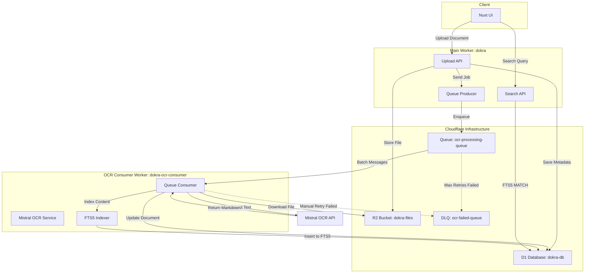

# OCR Scanning Implementation Plan - Updated for Cloudflare

## Overview

This document outlines the implementation of automatic OCR scanning using Mistral API, Cloudflare Queues for async processing, and SQLite FTS5 for full-text search.

**Key Architecture Change**: Cloudflare Queue consumers must be deployed as **separate Workers**, not as part of the main Nuxt application worker.

## Architecture Diagram



## Critical Cloudflare Architecture Notes

### 1. Two Separate Workers Required

**Main Worker (`dokra`):**
- Runs the Nuxt/Nitro application
- Handles HTTP requests (upload, search, API endpoints)
- Has Queue Producer binding only
- Deployed via main `wrangler.jsonc`

**OCR Consumer Worker (`dokra-ocr-consumer`):**
- Dedicated worker for processing queue messages
- Has Queue Consumer binding
- Has access to R2, D1, and DLQ Producer
- Deployed via `wrangler.queue.jsonc`

### 2. Queue Configuration

Queues are configured **separately** from workers. The consumer settings (max_batch_size, retries, etc.) are set in the consumer worker's wrangler.jsonc, not when creating the queue.

### 3. Bindings Structure

**Main Worker Bindings:**
```jsonc
{
  "DB": D1Database,
  "R2": R2Bucket,
  "OCR_QUEUE_PRODUCER": Queue  // Producer only
}
```

**OCR Consumer Worker Bindings:**
```jsonc
{
  "DB": D1Database,
  "R2": R2Bucket,
  "OCR_DLQ": Queue  // Producer for DLQ
  // Queue consumer configured via queues.consumers
}
```

## Phase 1: Infrastructure & Configuration ✅

### 1.1 Main Worker Configuration (`wrangler.jsonc`)

**Status**: ✅ Fixed

```jsonc
{
  "queues": {
    "producers": [
      {
        "binding": "OCR_QUEUE_PRODUCER",
        "queue": "ocr-processing-queue"
      }
    ]
  }
}
```

### 1.2 OCR Consumer Worker Configuration (`wrangler.queue.jsonc`)

**Status**: ✅ Created

```jsonc
{
  "name": "dokra-ocr-consumer",
  "main": "server/workers/index..ts",
  "d1_databases": [...],
  "r2_buckets": [...],
  "queues": {
    "consumers": [
      {
        "queue": "ocr-processing-queue",
        "max_batch_size": 10,
        "max_batch_timeout": 30,
        "max_retries": 3,
        "dead_letter_queue": "ocr-failed-queue",
        "max_concurrency": 5,
        "retry_delay": 120
      }
    ],
    "producers": [
      {
        "binding": "OCR_DLQ",
        "queue": "ocr-failed-queue"
      }
    ]
  }
}
```

### 1.3 Environment Variables & Secrets

Add secrets to **both workers**:

```bash
# For main worker (dokra)
npx wrangler secret put MISTRAL_API_KEY

# For OCR consumer worker (dokra-ocr-consumer)
npx wrangler secret put MISTRAL_API_KEY --config wrangler.jsonc
```

**Note**: Secrets must be set separately for each worker.

## Phase 2: Database Schema Updates

### 2.1 Documents Table Enhancement

**Status**: ✅ Already implemented

Document status enum includes:
- `inbox` - Default after upload, awaiting user review
- `ocr_pending` - Queued for OCR processing
- `ocr_failed` - OCR processing failed
- `verified` - User verified the document
- `archived` - Moved to archive

### 2.2 FTS5 Virtual Table Migration

**Status**: ⚠️ Needs creation

Create `server/db/migrations/XXXX_fts_setup.sql`:

```sql
-- Create FTS5 virtual table for full-text search
CREATE VIRTUAL TABLE IF NOT EXISTS documents_fts USING fts5(
    documentId UNINDEXED,
    title,
    extractedText,
    tokenize='porter unicode61'
);

-- Note: D1 does not support triggers yet, so we'll manually sync in code
```

**Important**: D1 doesn't support triggers, so FTS5 must be manually updated in application code after document updates.

## Phase 3: Queue Producer Implementation ✅

### 3.1 OCR Job Types

**Status**: ✅ Already exists at `server/types/ocr.ts`

```typescript
export interface OCRJobMessage {
    documentId: string;
    organizationId: string;
    r2Key: string;
    mimeType: string;
    fileName: string;
    retryCount: number;
    createdAt: string;
}
```

### 3.2 Document Upload API

**Status**: ✅ Already implemented at `server/api/documents/index.post.ts`

The upload API correctly:
1. Uploads file to R2
2. Creates document record with status 'inbox'
3. Enqueues OCR job
4. Updates status to 'ocr_pending'

## Phase 4: OCR Consumer Worker ✅

### 4.1 Queue Consumer Handler

**Status**: ✅ Already exists at `server/workers/index..ts`

Implements:
- Batch message processing
- Retry logic (up to 3 retries)
- Dead letter queue forwarding
- Document status updates

### 4.2 Mistral OCR Integration

**Status**: ✅ Already exists at `server/services/mistral-ocr.ts`

Correctly:
- Encodes file as base64
- Calls Mistral OCR API
- Handles errors
- Returns extracted markdown text

## Phase 5: Database Updates & FTS5 Sync

### 5.1 Manual FTS5 Sync Required

Since D1 doesn't support triggers, update the `updateDocumentWithOCR` function:

```typescript
async function updateDocumentWithOCR(
  documentId: string,
  extractedText: string,
  env: Env
): Promise<void> {
  const db = useDatabase(env.DB);
  const now = new Date().toISOString();

  // Get document title first
  const doc = await db.query.documents.findFirst({
    where: eq(documents.id, documentId),
  });

  // Update main document
  await db
    .update(documents)
    .set({
      extractedText,
      status: 'inbox',
      processedAt: now,
      updatedAt: now,
    })
    .where(eq(documents.id, documentId));

  // Manually sync to FTS5
  await db.execute(sql`
    INSERT INTO documents_fts(documentId, title, extractedText)
    VALUES (${documentId}, ${doc?.title || ''}, ${extractedText})
  `);
}
```

## Phase 6: Search Implementation

### 6.1 Create Search API Endpoint

**Status**: ⚠️ Needs update for FTS5

Update `server/api/search.post.ts`:

```typescript
import { sql } from 'drizzle-orm';

export default defineEventHandler(async (event) => {
    const { query, organizationId } = await readBody(event);
    const db = useDatabase(event.context.cloudflare.env.DB);
    
    // FTS5 search query
    const results = await db.execute(sql`
        SELECT 
            d.id,
            d.title,
            d.fileName,
            d.documentType,
            d.status,
            d.createdAt,
            snippet(documents_fts, 2, '<mark>', '</mark>', '...', 15) as excerpt,
            rank
        FROM documents d
        INNER JOIN documents_fts fts ON d.id = fts.documentId
        WHERE d.organizationId = ${organizationId}
          AND documents_fts MATCH ${query}
        ORDER BY rank
        LIMIT 50
    `);
    
    return { results: results.rows };
});
```

## Phase 7: Deployment Steps

### 7.1 Create Cloudflare Queues

```bash
# Create main queue
npx wrangler queues create ocr-processing-queue

# Create dead letter queue
npx wrangler queues create ocr-failed-queue
```

### 7.2 Set Secrets (Both Workers)

```bash
# Main worker
npx wrangler secret put MISTRAL_API_KEY

# OCR consumer worker
npx wrangler secret put MISTRAL_API_KEY --config wrangler.jsonc

# Other secrets as needed
npx wrangler secret put BETTER_AUTH_SECRET
npx wrangler secret put BETTER_AUTH_URL
# etc...
```

### 7.3 Run Database Migrations

```bash
# Generate migration if needed
npx drizzle-kit generate

# Apply migrations
npx drizzle-kit push
```

### 7.4 Deploy Workers

```bash
# Deploy main Nuxt worker
npm run build
npx wrangler deploy

# Deploy OCR consumer worker
npx wrangler deploy --config wrangler.jsonc
```

**Important**: Deploy order matters:
1. Create queues first
2. Deploy OCR consumer worker
3. Deploy main worker

## File Structure

```
dokra/
├── wrangler.jsonc                    # Main worker config ✅
├── wrangler.queue.jsonc              # OCR consumer config ✅ NEW
├── server/
│   ├── api/
│   │   ├── documents/
│   │   │   ├── index.post.ts         # Upload API ✅
│   │   │   └── [id]/
│   │   │       └── retry-ocr.post.ts # ⚠️ TODO
│   │   ├── search.get.ts             # ⚠️ Needs FTS5 update
│   │   └── search.post.ts            # ⚠️ Needs FTS5 update
│   ├── db/
│   │   ├── migrations/
│   │   │   └── XXXX_fts_setup.sql    # ⚠️ TODO
│   │   └── schema/
│   │       └── documents.ts          # ✅
│   ├── services/
│   │   └── mistral-ocr.ts            # ✅
│   ├── types/
│   │   └── ocr.ts                    # ✅
│   └── workers/
│       └── index..ts           # ✅
└── docs/
    └── ocr-cloudflare-guide.md       # This file
```

## Testing the Integration

### 1. Local Development

**Note**: Queue consumers can't run in `wrangler dev` with Nuxt. Use `wrangler tail` to monitor:

```bash
# Terminal 1: Run main Nuxt app
npm run dev

# Terminal 2: Monitor OCR consumer logs
npx wrangler tail dokra-ocr-consumer --config wrangler.jsonc
```

For local testing, you may need to:
- Use Miniflare for queue simulation
- Or deploy to preview environment and test there

### 2. Monitor Queue

```bash
# Check queue status
npx wrangler queues list

# View messages in queue
npx wrangler queues consumer show ocr-processing-queue

# View DLQ messages
npx wrangler queues consumer show ocr-failed-queue
```

### 3. Test Upload Flow

1. Upload a document via UI
2. Check document status is `ocr_pending`
3. Monitor consumer logs for processing
4. Verify document status changes to `inbox`
5. Verify `extractedText` is populated
6. Test search functionality

## Retry Failed OCR Implementation

**Status**: ⚠️ TODO

Create `server/api/documents/[id]/retry-ocr.post.ts`:

```typescript
export default defineEventHandler(async (event) => {
    const documentId = getRouterParam(event, 'id');
    const db = useDatabase(event.context.cloudflare.env.DB);
    
    // Get document info
    const doc = await db.query.documents.findFirst({
        where: eq(documents.id, documentId),
    });
    
    if (!doc) {
        throw createError({ status: 404, message: 'Document not found' });
    }
    
    // Verify user has access
    await requireOrgMembership(event, doc.organizationId);
    
    // Re-enqueue for OCR
    const ocrJob: OCRJobMessage = {
        documentId: doc.id,
        organizationId: doc.organizationId,
        r2Key: doc.r2Key,
        mimeType: doc.mimeType || 'application/pdf',
        fileName: doc.fileName,
        retryCount: 0,
        createdAt: new Date().toISOString(),
    };
    
    await event.context.cloudflare.env.OCR_QUEUE_PRODUCER.send(ocrJob);
    
    // Update status
    await db.update(documents)
        .set({ status: 'ocr_pending', updatedAt: new Date().toISOString() })
        .where(eq(documents.id, documentId));
    
    return { success: true };
});
```

## Common Issues & Solutions

### Issue: Consumer not receiving messages

**Solution**: 
- Verify consumer worker is deployed: `npx wrangler deployments list --config wrangler.queue.jsonc`
- Check queue binding matches: `ocr-processing-queue`
- Ensure consumer is subscribed: `npx wrangler queues consumer show ocr-processing-queue`

### Issue: Messages going to DLQ immediately

**Solution**:
- Check consumer logs for errors: `npx wrangler tail dokra-ocr-consumer`
- Verify all bindings (R2, D1) are accessible
- Confirm MISTRAL_API_KEY secret is set for consumer worker

### Issue: FTS5 search not returning results

**Solution**:
- Verify FTS5 table exists: Check migrations
- Ensure manual sync is happening after OCR
- Test FTS5 directly: `SELECT * FROM documents_fts WHERE documents_fts MATCH 'test'`

### Issue: Duplicate processing

**Solution**:
- Ensure messages are being `ack()`'d after successful processing
- Check for infinite retry loops in error handling
- Monitor queue depth: `npx wrangler queues list`

### Issue: Buffer is not defined

**Error**: `ReferenceError: Buffer is not defined`

**Cause**: `Buffer` is a Node.js API, not available in Cloudflare Workers

**Solution**:
Replace `Buffer.from(data).toString('base64')` with Web Standard APIs:

```typescript
function arrayBufferToBase64(buffer: ArrayBuffer): string {
    const bytes = new Uint8Array(buffer);
    let binary = '';
    for (let i = 0; i < bytes.length; i++) {
        binary += String.fromCharCode(bytes[i]);
    }
    return btoa(binary);
}
```

See `docs/BUFFER-ERROR-FIX.md` for more details.

## Performance Tuning

### Queue Consumer Settings

```jsonc
{
  "max_batch_size": 10,        // Process up to 10 messages at once
  "max_batch_timeout": 30,     // Wait max 30s to fill batch
  "max_retries": 3,            // Retry failed messages 3 times
  "max_concurrency": 5,        // Run up to 5 consumer instances
  "retry_delay": 120           // Wait 120s between retries
}
```

Adjust based on:
- **High volume**: Increase `max_batch_size` and `max_concurrency`
- **Large files**: Decrease `max_batch_size`, increase `max_batch_timeout`
- **API rate limits**: Decrease `max_concurrency`

### Mistral API Considerations

- Free tier: 500 credits (~500 pages)
- Rate limits: Check Mistral dashboard
- Timeout: Default 30s, may need increase for large PDFs

## Next Steps Checklist

- [ ] Create FTS5 migration file
- [ ] Update OCR consumer to sync FTS5 manually
- [ ] Update search API endpoints for FTS5
- [ ] Create retry-ocr API endpoint
- [ ] Add UI indicators for OCR status
- [ ] Deploy both workers
- [ ] Test end-to-end flow
- [ ] Monitor queue and DLQ
- [ ] Set up alerts for DLQ messages

## Cost Estimation

**Cloudflare Costs** (Workers Paid Plan):
- Queue operations: $0.40 per million operations
- D1 writes: $1.00 per million rows
- R2 reads: $0.36 per million (Class A operations)
- Worker invocations: Included in paid plan

**Mistral API Costs**:
- OCR: ~1 credit per page
- Check current pricing at https://mistral.ai/pricing

**Example**: 1000 documents/month, average 5 pages each:
- Queue operations: ~5000 (negligible cost)
- D1 writes: ~10000 (negligible cost)
- R2 reads: ~1000 (negligible cost)
- Mistral OCR: ~5000 pages (~$X, check current pricing)

## Support Resources

- Cloudflare Queues Docs: https://developers.cloudflare.com/queues/
- D1 FTS5 Guide: https://developers.cloudflare.com/d1/tutorials/fts5/
- Mistral OCR API: https://docs.mistral.ai/capabilities/vision/
- Wrangler CLI: https://developers.cloudflare.com/workers/wrangler/

---

**Last Updated**: 2026-01-24
**Status**: Architecture fixed, ready for implementation of remaining TODOs
