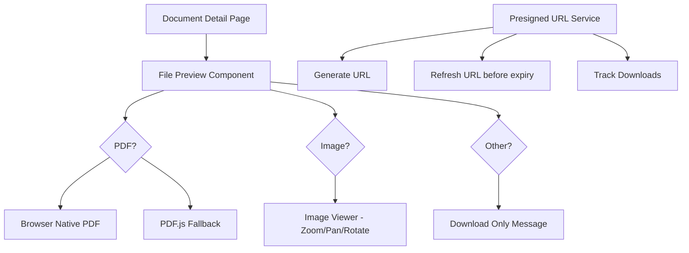

# Document Viewer Implementation Plan

## Overview

Implement document viewing and download functionality with:
- Browser-native PDF viewer + PDF.js fallback
- Image viewer with zoom/pan/rotate
- Presigned URL generation with automatic refresh mechanism
- Download tracking in database

## Architecture



## Implementation Steps

### Phase 1: Dependencies & Backend

#### 1.1 Add AWS SDK Dependencies
```bash
pnpm add @aws-sdk/client-s3 @aws-sdk/s3-request-presigner
```

#### 1.2 Create R2 Presigned URL Utility
**File**: `server/utils/r2-presigned.ts`

```typescript
import { S3Client, GetObjectCommand } from "@aws-sdk/client-s3";
import { getSignedUrl } from "@aws-sdk/s3-request-presigner";

const R2_CONFIG = {
  region: "auto",
  endpoint: `https://${process.env.CF_ACCOUNT_ID}.r2.cloudflarestorage.com`,
  credentials: {
    accessKeyId: process.env.R2_ACCESS_KEY_ID!,
    secretAccessKey: process.env.R2_SECRET_ACCESS_KEY!,
  },
};

const BUCKET_NAME = process.env.R2_BUCKET_NAME || "dokra-files";

export async function generatePresignedUrl(
  r2Key: string,
  expiresIn: number = 3600 // 1 hour default
): Promise<string> {
  const client = new S3Client(R2_CONFIG);
  const command = new GetObjectCommand({
    Bucket: BUCKET_NAME,
    Key: r2Key,
  });
  
  return getSignedUrl(client, command, { expiresIn });
}

export async function generateDownloadPresignedUrl(
  r2Key: string,
  fileName: string,
  expiresIn: number = 3600
): Promise<string> {
  const url = await generatePresignedUrl(r2Key, expiresIn);
  // The download behavior is controlled client-side via download attribute
  return url;
}
```

#### 1.3 Create View Endpoint
**File**: `server/api/documents/[id]/view.get.ts`

```typescript
import { eq } from "drizzle-orm";
import { useDatabase } from "../../../utils/db";
import { requireAuth } from "../../../utils/require-auth";
import { documents } from "../../../db/schema";
import { generatePresignedUrl } from "../../../utils/r2-presigned";

export default defineEventHandler(async (event) => {
  requireAuth(event);
  const documentId = getRouterParam(event, "id");
  
  if (!documentId) {
    throw createError({ statusCode: 400, message: "document ID required" });
  }
  
  const db = useDatabase(event.context.cloudflare.env.DB);
  
  const doc = await db
    .select()
    .from(documents)
    .where(eq(documents.id, documentId))
    .get();
  
  if (!doc) {
    throw createError({ statusCode: 404, message: "document not found" });
  }
  
  // Verify user has access to organization
  // TODO: Add org access check
  
  const viewUrl = await generatePresignedUrl(doc.r2Key, 3600);
  
  return {
    viewUrl,
    expiresIn: 3600,
    mimeType: doc.mimeType,
    fileName: doc.fileName,
  };
});
```

#### 1.4 Update Download Endpoint for Presigned URLs
**File**: `server/api/documents/[id]/download.get.ts` (modify existing)

Instead of streaming the file, return a presigned URL that triggers download:

```typescript
// Add this to existing file
import { generatePresignedUrl } from "../../../utils/r2-presigned";

// In the handler, replace file streaming with:
const downloadUrl = await generatePresignedUrl(r2Key, 3600);
return {
  downloadUrl,
  expiresIn: 3600,
  fileName: doc.fileName,
  mimeType: doc.mimeType,
};
```

#### 1.5 Create Download Events Table
**File**: `server/db/schema/download-events.ts`

```typescript
import sqliteTable, { text, integer } from "drizzle-orm/sqlite-core";
import { sql } from "drizzle-orm";

export const downloadEvents = sqliteTable("download_events", {
  id: text("id").primaryKey(),
  documentId: text("document_id").notNull(),
  userId: text("user_id").notNull(),
  organizationId: text("organization_id").notNull(),
  downloadedAt: text("downloaded_at").default(sql`(CURRENT_TIMESTAMP)`).notNull(),
  ipAddress: text("ip_address"),
  userAgent: text("user_agent"),
});
```

#### 1.6 Add CORS Configuration to R2 Bucket
**File**: `wrangler.jsonc` (update)

```json
{
  "r2_buckets": [
    {
      "binding": "R2",
      "bucket_name": "dokra-files",
      "preview_bucket_name": "dokra-files-preview",
      "cors": [
        {
          "origin": ["*"],
          "method": ["GET", "HEAD"],
          "response_headers": ["Content-Type", "Content-Disposition"],
          "max_age_seconds": 3600
        }
      ]
    }
  ]
}
```

### Phase 2: Frontend Components

#### 2.1 Presigned URL Refresh Composable
**File**: `app/composables/usePresignedUrl.ts`

```typescript
export function usePresignedUrl() {
  const refreshInterval = ref<NodeJS.Timeout | null>(null);
  
  async function refreshUrl(documentId: string): Promise<string> {
    const response = await $fetch<{ viewUrl: string; expiresIn: number }>(
      `/api/documents/${documentId}/view`
    );
    return response.viewUrl;
  }
  
  function startAutoRefresh(
    documentId: string,
    onRefresh: (url: string) => void,
    expiresIn: number = 3600
  ) {
    // Refresh 5 minutes before expiry
    const refreshTime = (expiresIn - 300) * 1000;
    
    refreshInterval.value = setInterval(async () => {
      const newUrl = await refreshUrl(documentId);
      onRefresh(newUrl);
    }, refreshTime);
  }
  
  function stopAutoRefresh() {
    if (refreshInterval.value) {
      clearInterval(refreshInterval.value);
      refreshInterval.value = null;
    }
  }
  
  onUnmounted(() => {
    stopAutoRefresh();
  });
  
  return {
    refreshUrl,
    startAutoRefresh,
    stopAutoRefresh,
  };
}
```

#### 2.2 PDF Viewer Component
**File**: `app/components/PdfViewer.vue`

```vue
<script setup lang="ts">
const props = defineProps<{
  src: string;
  fileName: string;
}>();

const showPdfJsFallback = ref(false);
const pdfJsViewerRef = ref<HTMLDivElement>();

// Browser-native PDF viewer
function useNativeViewer() {
  return `
    <embed 
      src="${props.src}#toolbar=0&navpanes=0&scrollbar=0" 
      type="application/pdf" 
      class="w-full h-full"
    />
  `;
}

// PDF.js fallback
async function initPdfJs() {
  // Dynamically import PDF.js for fallback
  // This will be loaded only when needed
}
</script>

<template>
  <div class="pdf-viewer relative w-full h-full">
    <!-- Browser Native -->
    <div v-if="!showPdfJsFallback" class="native-viewer w-full h-full">
      <embed 
        :src="src" 
        type="application/pdf" 
        class="w-full h-full rounded-lg"
      />
    </div>
    
    <!-- PDF.js Fallback -->
    <div v-else ref="pdfJsViewerRef" class="pdfjs-viewer w-full h-full" />
    
    <!-- Fallback Toggle -->
    <button 
      class="btn btn-sm btn-ghost absolute bottom-4 right-4"
      @click="showPdfJsFallback = !showPdfJsFallback"
    >
      {{ showPdfJsFallback ? 'Use Native Viewer' : 'Use PDF.js Viewer' }}
    </button>
  </div>
</template>
```

#### 2.3 Image Viewer Component
**File**: `app/components/ImageViewer.vue`

```vue
<script setup lang="ts">
const props = defineProps<{
  src: string;
  fileName: string;
}>();

const emit = defineEmits<{
  close: [];
  download: [];
}>();

// Image state
const scale = ref(1);
const rotation = ref(0);
const position = reactive({ x: 0, y: 0 });
const isDragging = ref(false);
const dragStart = reactive({ x: 0, y: 0 });

// Zoom controls
function zoomIn() {
  scale.value = Math.min(scale.value + 0.25, 3);
}

function zoomOut() {
  scale.value = Math.max(scale.value - 0.25, 0.25);
}

function resetZoom() {
  scale.value = 1;
  rotation.value = 0;
  position.x = 0;
  position.y = 0;
}

// Rotation
function rotateLeft() {
  rotation.value -= 90;
}

function rotateRight() {
  rotation.value += 90;
}

// Pan functionality
function startDrag(e: MouseEvent) {
  isDragging.value = true;
  dragStart.x = e.clientX - position.x;
  dragStart.y = e.clientY - position.y;
}

function onDrag(e: MouseEvent) {
  if (!isDragging.value) return;
  position.x = e.clientX - dragStart.x;
  position.y = e.clientY - dragStart.y;
}

function stopDrag() {
  isDragging.value = false;
}

// Keyboard navigation
function handleKeydown(e: KeyboardEvent) {
  switch (e.key) {
    case '+':
    case '=':
      zoomIn();
      break;
    case '-':
      zoomOut();
      break;
    case 'r':
      resetZoom();
      break;
    case 'ArrowLeft':
      rotateLeft();
      break;
    case 'ArrowRight':
      rotateRight();
      break;
    case 'Escape':
      emit('close');
      break;
  }
}

// Computed styles for transform
const imageStyle = computed(() => ({
  transform: `scale(${scale.value}) rotate(${rotation.value}deg)`,
  cursor: isDragging.value ? 'grabbing' : 'grab',
}));
</script>

<template>
  <div 
    class="image-viewer fixed inset-0 bg-black/90 z-50 flex flex-col"
    tabindex="0"
    @keydown="handleKeydown"
  >
    <!-- Toolbar -->
    <div class="toolbar flex items-center justify-between p-4 bg-base-100">
      <div class="flex items-center gap-4">
        <h3 class="font-medium">{{ fileName }}</h3>
      </div>
      
      <div class="flex items-center gap-2">
        <!-- Zoom -->
        <button class="btn btn-sm btn-ghost" @click="zoomOut">−</button>
        <span class="w-12 text-center">{{ Math.round(scale * 100) }}%</span>
        <button class="btn btn-sm btn-ghost" @click="zoomIn">+</button>
        <button class="btn btn-sm btn-ghost" @click="resetZoom">Reset</button>
        
        <div class="divider divider-horizontal mx-1"></div>
        
        <!-- Rotate -->
        <button class="btn btn-sm btn-ghost" @click="rotateLeft">↺</button>
        <button class="btn btn-sm btn-ghost" @click="rotateRight">↻</button>
        
        <div class="divider divider-horizontal mx-1"></div>
        
        <!-- Actions -->
        <button class="btn btn-sm btn-primary" @click="$emit('download')">
          Download
        </button>
        <button class="btn btn-sm btn-ghost" @click="$emit('close')">
          Close
        </button>
      </div>
    </div>
    
    <!-- Image Container -->
    <div 
      class="flex-1 overflow-hidden flex items-center justify-center p-4"
      @mousedown="startDrag"
      @mousemove="onDrag"
      @mouseup="stopDrag"
      @mouseleave="stopDrag"
    >
      
    </div>
    
    <!-- Instructions -->
    <div class="text-center p-2 text-sm text-base-content/60 bg-base-100">
      Use keyboard: [+/-] zoom, [R] reset, [←/→] rotate, [ESC] close
    </div>
  </div>
</template>
```

#### 2.4 Document Preview Card Component
**File**: `app/components/DocumentPreview.vue`

```vue
<script setup lang="ts">
import type { DocumentDetail } from '~~/types';

const props = defineProps<{
  document: DocumentDetail;
}>();

const emit = defineEmits<{
  view: [url: string];
  download: [];
}>();

const { refreshUrl, startAutoRefresh, stopAutoRefresh } = usePresignedUrl();
const currentUrl = ref('');
const isLoading = ref(true);
const showImageViewer = ref(false);

// Determine if file is viewable
const isPdf = computed(() => props.document.mimeType === 'application/pdf');
const isImage = computed(() => props.document.mimeType?.startsWith('image/'));
const isViewable = computed(() => isPdf.value || isImage.value);

// Fetch initial view URL
async function loadViewUrl() {
  isLoading.value = true;
  try {
    const response = await $fetch<{ viewUrl: string; expiresIn: number }>(
      `/api/documents/${props.document.id}/view`
    );
    currentUrl.value = response.viewUrl;
    
    // Start auto-refresh
    startAutoRefresh(props.document.id, (url) => {
      currentUrl.value = url;
    }, response.expiresIn);
  } catch (error) {
    console.error('Failed to load view URL:', error);
  } finally {
    isLoading.value = false;
  }
}

onMounted(() => {
  if (isViewable.value) {
    loadViewUrl();
  }
});

onUnmounted(() => {
  stopAutoRefresh();
});

function handleView() {
  if (currentUrl.value) {
    emit('view', currentUrl.value);
    if (isImage.value) {
      showImageViewer.value = true;
    }
    // PDFs open in same tab via embed
  }
}

function handleDownload() {
  emit('download');
}
</script>

<template>
  <div class="document-preview">
    <!-- Loading State -->
    <div v-if="isLoading" class="h-64 bg-base-200 rounded-lg animate-pulse" />
    
    <!-- Preview Content -->
    <div v-else-if="isViewable" class="space-y-4">
      <!-- PDF Preview -->
      <div v-if="isPdf && currentUrl" class="pdf-container h-[600px] border border-base-300 rounded-lg overflow-hidden">
        <embed 
          :src="currentUrl" 
          type="application/pdf" 
          class="w-full h-full"
        />
      </div>
      
      <!-- Image Preview (thumbnail) -->
      <div v-else-if="isImage && currentUrl" class="image-container">
        
      </div>
      
      <!-- Actions -->
      <div class="flex gap-2">
        <button 
          v-if="isViewable"
          class="btn btn-primary gap-2" 
          @click="handleView"
        >
          <Icon name="heroicons:eye" class="w-4 h-4" />
          View Full
        </button>
        <button 
          class="btn btn-outline gap-2" 
          @click="handleDownload"
        >
          <Icon name="heroicons:arrow-down-tray" class="w-4 h-4" />
          Download
        </button>
      </div>
    </div>
    
    <!-- Non-viewable file -->
    <div v-else class="non-viewable p-8 text-center bg-base-200 rounded-lg">
      <Icon name="heroicons:document" class="w-12 h-12 mx-auto text-base-content/40 mb-2" />
      <p class="text-base-content/60 mb-4">
        {{ document.fileName }}
      </p>
      <button 
        class="btn btn-primary gap-2" 
        @click="handleDownload"
      >
        <Icon name="heroicons:arrow-down-tray" class="w-4 h-4" />
        Download File
      </button>
    </div>
    
    <!-- Image Viewer Modal -->
    <ImageViewer
      v-if="showImageViewer && currentUrl"
      :src="currentUrl"
      :file-name="document.fileName"
      @close="showImageViewer = false"
      @download="handleDownload"
    />
  </div>
</template>
```

#### 2.5 Update Document Detail Page
**File**: `app/pages/documents/[id].vue` (add preview section)

Add to the template (after header section):

```vue
<!-- File Preview Section -->
<div class="card bg-base-100 border border-base-300">
  <div class="card-body">
    <h2 class="card-title text-base">Preview</h2>
    <DocumentPreview
      v-if="document"
      :document="document"
      @view="handleView"
      @download="handleDownload"
    />
  </div>
</div>
```

Add handler for view:

```typescript
function handleView(url: string) {
  // For images, opens in ImageViewer modal
  // For PDFs, embed handles display
}
```

### Phase 3: Type Updates

**File**: `types/document.ts` (add)

```typescript
export interface DocumentViewResponse {
  viewUrl: string;
  expiresIn: number;
  mimeType: string;
  fileName: string;
}

export interface DocumentDownloadResponse {
  downloadUrl: string;
  expiresIn: number;
  mimeType: string;
  fileName: string;
}
```

### Phase 4: Testing

Create unit tests for:
- Presigned URL generation
- URL refresh mechanism
- Image viewer zoom/rotate functions
- PDF viewer fallback switching

### Phase 5: CORS Configuration

Ensure R2 bucket has proper CORS rules for presigned URLs to work from browser.

## File Structure Summary

```
app/
├── components/
│   ├── DocumentPreview.vue    # Main preview component
│   ├── PdfViewer.vue          # PDF viewer with fallback
│   └── ImageViewer.vue        # Image viewer with zoom/rotate
├── composables/
│   └── usePresignedUrl.ts     # URL generation & refresh
└── pages/
    └── documents/
        └── [id].vue           # Updated with preview section

server/
├── api/
│   └── documents/
│       └── [id]/
│           ├── view.get.ts    # NEW: view endpoint
│           └── download.get.ts # UPDATED: presigned URL
└── utils/
    └── r2-presigned.ts        # NEW: presigned URL utility

types/
└── document.ts                # UPDATED: add response types

server/db/schema/
└── download-events.ts         # NEW: download tracking table
```

## Environment Variables Needed

```env
# Add to .env.example
CF_ACCOUNT_ID=your-cloudflare-account-id
R2_ACCESS_KEY_ID=your-r2-access-key
R2_SECRET_ACCESS_KEY=your-r2-secret-key
R2_BUCKET_NAME=dokra-files
```

## Security Considerations

1. Presigned URLs expire in 1 hour (configurable)
2. Auto-refresh mechanism keeps viewers alive
3. All endpoints require authentication
4. CORS configured for specific origins only

## Next Steps

1. Review and approve this plan
2. Switch to Code mode to implement
3. Test with PDF and image files
4. Verify download tracking works
