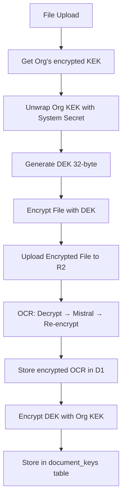
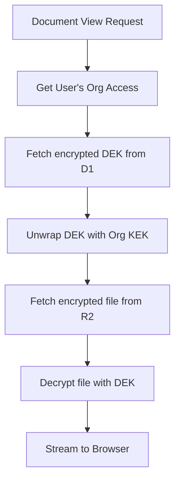

# AES-256 GCM Encryption Implementation Plan (Updated)

**Project:** Dokra - Transient Privacy Architecture  
**Date:** 2026-01-27  
**Status:** Draft - Updated for Org-Wide Sharing  
**Version:** 1.1

---

## Executive Summary

This plan outlines a 3-phase implementation of envelope encryption for Project Dokra, ensuring all files and extracted text are encrypted at rest using AES-256-GCM. 

**Key Change from v1.0:** Documents are shared across organization members using an **Organization KEK** that all authenticated members can access, while maintaining the per-user KEK for personal security.

### Encryption Key Hierarchy

```
System Secret (Environment Variable)
    ↓ (encrypts)
Organization KEK (per org, shared by all members)
    ↓ (encrypts)
    ├── DEK per Document (encrypts file + OCR text)
    └── User Personal KEK (optional, for user-specific keys)
```

---

## 1. Architecture Overview

### 1.1 Three-Tier Key Hierarchy

```mermaid
flowchart TD
    subgraph System Level
        SS[System Secret<br/>Env Variable]
    end
    
    subgraph Org Level
        OK[Org KEK<br/>32-byte]
    end
    
    subgraph User Level - Optional
        UK[User KEK<br/>Personal]
    end
    
    subgraph Document Level
        DK[DEK<br/>Per Document]
    end
    
    SS -->|encrypts| OK
    OK -->|encrypts| DK
    DK -->|encrypts| File
    DK -->|encrypts| OCR Text
    
    OK -.->|shared to all<br/>org members| M1[Member 1]
    OK -.->|shared to all<br/>org members| M2[Member 2]
    OK -.->|shared to all<br/>org members| M3[Member 3]
```

### 1.2 Why Organization-Wide Sharing?

- **Use Case**: Invoice uploaded by accounting → visible to finance team
- **Use Case**: Contract uploaded by manager → visible to legal team
- **Security**: Only authenticated org members can access
- **Fallback**: User personal KEK still available for sensitive documents

### 1.3 Encryption Flow (Upload)



### 1.4 Decryption Flow (View)



---

## 2. File Structure

### 2.1 Updated Directory Structure

```
dokra/
├── shared/
│   ├── crypto/
│   │   ├── src/
│   │   │   ├── index.ts
│   │   │   ├── key-manager.ts          # KeyManager class - UPDATED
│   │   │   ├── crypto-utils.ts         # AES-256-GCM primitives
│   │   │   ├── types.ts                # TypeScript interfaces - UPDATED
│   │   │   └── errors.ts
│   │   ├── package.json
│   │   └── tsconfig.json
│   └── database/
│       └── src/schema/
│           ├── users.ts                # REMOVED user KEK fields
│           ├── organizations.ts        # UPDATED: Add org KEK fields
│           ├── documents.ts            # UPDATED: Add encrypted OCR
│           └── document-keys.ts        # UPDATED: Store org-scoped DEKs
│
├── dokra-application/
│   ├── server/
│   │   ├── api/
│   │   │   ├── organizations/
│   │   │   │   └── [id]/
│   │   │   │       └── keks.post.ts    # NEW: Org KEK management
│   │   │   └── documents/
│   │   │       └── index.post.ts       # UPDATED: Encrypt on upload
│   │   └── utils/
│   │       └── encryption.ts           # Encryption service wrapper
│   └── types/
│       └── encryption.ts
│
└── workers/
    └── dokra-ocr-consumer/
        └── src/
            └── encryption.ts           # UPDATED: Decrypt for OCR
```

### 2.2 Key File Locations

| File | Purpose |
|------|---------|
| [`shared/crypto/src/key-manager.ts`](shared/crypto/src/key-manager.ts:1) | Core KeyManager with org support |
| [`shared/crypto/src/crypto-utils.ts`](shared/crypto/src/crypto-utils.ts:1) | AES-256-GCM primitives |
| [`shared/crypto/src/types.ts`](shared/crypto/src/types.ts:1) | Updated type definitions |
| [`shared/database/src/schema/organizations.ts`](shared/database/src/schema/organizations.ts:1) | Org KEK storage |
| [`shared/database/src/schema/document-keys.ts`](shared/database/src/schema/document-keys.ts:1) | DEK per org+doc |

---

## 3. Database Schema Changes

### 3.1 Updated Organizations Table

**File:** `shared/database/src/schema/organizations.ts`

```typescript
import { sqliteTable, text, integer } from 'drizzle-orm/sqlite-core';

export const organizations = sqliteTable('organizations', {
    id: text('id').primaryKey(),
    name: text('name').notNull(),
    ownerId: text('owner_id').notNull(),
    encryptedKek: text('encrypted_kek'),     // NEW: Org KEK encrypted by System Secret
    kekIv: text('kek_iv'),                   // NEW: IV for org KEK encryption
    kekTag: text('kek_tag'),                 // NEW: Auth tag
    kekCreatedAt: text('kek_created_at'),    // NEW: Track key age
    createdAt: text('created_at').notNull(),
    updatedAt: text('updated_at').notNull(),
});
```

### 3.2 Updated Users Table (No KEK fields)

**File:** `shared/database/src/schema/users.ts`

```typescript
import { sqliteTable, text, integer, index } from 'drizzle-orm/sqlite-core';

export const users = sqliteTable('users', {
    id: text('id').primaryKey(),
    name: text('name').notNull(),
    email: text('email').notNull().unique(),
    emailVerified: integer('email_verified', { mode: 'boolean' }).notNull().default(false),
    image: text('image'),
    role: text('role').default('user'),
    banned: integer('banned', { mode: 'boolean' }).default(false),
    banReason: text('ban_reason'),
    banExpires: integer('ban_expires'),
    createdAt: integer('created_at', { mode: 'timestamp' }).notNull(),
    updatedAt: integer('updated_at', { mode: 'timestamp' }).notNull(),
}, (table) => [
    index('users_email_idx').on(table.email),
]);
```

### 3.3 Updated Documents Table

**File:** `shared/database/src/schema/documents.ts`

```typescript
import { sqliteTable, text, integer, index, sql } from 'drizzle-orm/sqlite-core';

export const documents = sqliteTable('documents', {
    id: text('id').primaryKey(),
    organizationId: text('organization_id').notNull().references(() => organizations.id, { onDelete: 'cascade' }),
    title: text('title').notNull(),
    r2Key: text('r2_key').notNull().unique(),
    fileName: text('file_name').notNull(),
    mimeType: text('mime_type'),
    fileSize: integer('file_size'),
    uploadedBy: text('uploaded_by').notNull(),
    encryptedOcrContent: text('encrypted_ocr_content'),  // AES-GCM encrypted, Base64
    ocrIv: text('ocr_iv'),
    ocrTag: text('ocr_tag'),
    documentType: text('document_type'),
    status: text('status').notNull().default('inbox'),
    dueDate: text('due_date'),
    reminderDaysBeforeDue: integer('reminder_days_before_due').default(7),
    tags: text('tags'),
    metadata: text('metadata'),
    processedAt: text('processed_at'),
    createdAt: text('created_at').default(sql`(CURRENT_TIMESTAMP)`).notNull(),
    updatedAt: text('updated_at').default(sql`(CURRENT_TIMESTAMP)`).notNull(),
}, (table) => [
    index('documents_org_idx').on(table.organizationId),
    index('documents_status_idx').on(table.status),
    index('documents_created_idx').on(table.createdAt),
]);
```

### 3.4 Updated Document Keys Table

**File:** `shared/database/src/schema/document-keys.ts`

```typescript
import { sqliteTable, text, index } from 'drizzle-orm/sqlite-core';

export const documentKeys = sqliteTable('document_keys', {
    organizationId: text('organization_id').notNull().references(() => organizations.id, { onDelete: 'cascade' }),
    documentId: text('document_id').notNull().references(() => documents.id, { onDelete: 'cascade' }),
    encryptedDek: text('encrypted_dek').notNull(),   // DEK encrypted with Org KEK
    dekIv: text('dek_iv').notNull(),
    dekTag: text('dek_tag'),
    createdAt: text('created_at').default(sql`(CURRENT_TIMESTAMP)`).notNull(),
}, (table) => [
    index('doc_keys_org_idx').on(table.organizationId),
    index('doc_keys_doc_idx').on(table.documentId),
]);
```

### 3.5 Schema Index Export

**File:** `shared/database/src/schema/index.ts`

```typescript
export { users } from './users';
export { organizations } from './organizations';
export { organizationUsers } from './organization-users';
export { documents, documentsFts } from './documents';
export { documentKeys } from './document-keys';
export { tags } from './tags';
export { documentTags } from './document-tags';
export { files } from './files';
export * from './auth';
```

---

## 4. Core Crypto Implementation

### 4.1 TypeScript Interfaces

**File:** `shared/crypto/src/types.ts`

```typescript
/**
 * Encryption key types
 */
export interface KeyPair {
    key: Uint8Array;
}

/**
 * Wrapped key storage format (for DB storage)
 */
export interface WrappedKey {
    ciphertext: string;   // Base64-encoded encrypted key
    iv: string;           // Base64-encoded initialization vector
    tag: string;          // Base64-encoded authentication tag
}

/**
 * Encrypted content storage format
 */
export interface EncryptedContent {
    ciphertext: string;   // Base64-encoded encrypted data
    iv: string;           // Base64-encoded initialization vector
    tag: string;          // Base64-encoded authentication tag
}

/**
 * KeyManager configuration
 */
export interface KeyManagerConfig {
    systemSecret: string;  // Master secret from environment
}

/**
 * Organization key metadata for database storage
 */
export interface OrgKeyMetadata {
    organizationId: string;
    encryptedKek: string;
    kekIv: string;
    kekTag: string;
    createdAt: string;
}

/**
 * Document key metadata for database storage
 */
export interface DocumentKeyMetadata {
    organizationId: string;
    documentId: string;
    encryptedDek: string;
    dekIv: string;
    dekTag: string;
    createdAt: string;
}

/**
 * Decryption result with metadata
 */
export interface DecryptionResult<T = Uint8Array> {
    data: T;
    metadata: {
        mimeType?: string;
        fileName?: string;
    };
}
```

### 4.2 KeyManager Class (Updated)

**File:** `shared/crypto/src/key-manager.ts`

```typescript
import {
    generateKey,
    generateIv,
    encryptAesGcm,
    decryptAesGcm,
    encryptString,
    decryptToString,
    type WrappedKey,
    type EncryptedContent
} from './crypto-utils';
import type {
    KeyManagerConfig,
    OrgKeyMetadata,
    DocumentKeyMetadata,
    DecryptionResult
} from './types';

/**
 * KeyManager handles envelope encryption operations for Dokra.
 * 
 * Key Hierarchy:
 * 1. System Secret (env var) - Encrypts Org KEK
 * 2. Org KEK (per org) - Encrypts document DEKs, shared by all org members
 * 3. DEK (per document) - Encrypts file content and OCR text
 */
export class KeyManager {
    private readonly systemSecret: string;
    private masterKey: CryptoKey | null = null;
    
    constructor(config: KeyManagerConfig) {
        this.systemSecret = config.systemSecret;
    }
    
    /**
     * Get or derive the master key from system secret
     * Uses PBKDF2 with 100k iterations for key derivation
     */
    private async getMasterKey(): Promise<CryptoKey> {
        if (this.masterKey) return this.masterKey;
        
        const encoder = new TextEncoder();
        const keyMaterial = await crypto.subtle.importKey(
            'raw',
            encoder.encode(this.systemSecret),
            'PBKDF2',
            false,
            ['deriveBits', 'deriveKey']
        );
        
        this.masterKey = await crypto.subtle.deriveKey(
            {
                name: 'PBKDF2',
                salt: encoder.encode('dokra-master-key-salt'),
                iterations: 100000,
                hash: 'SHA-256'
            },
            keyMaterial,
            { name: 'AES-GCM', length: 256 },
            false,
            ['encrypt', 'decrypt']
        );
        
        return this.masterKey;
    }
    
    // ==================== Key Generation ====================
    
    /**
     * Generate a new Organization KEK (32-byte)
     * Called once per organization during org creation
     */
    generateOrgKek(): Uint8Array {
        return crypto.getRandomValues(new Uint8Array(32));
    }
    
    /**
     * Generate a new Document DEK (32-byte)
     * Called once per document during upload
     */
    generateDocumentDek(): Uint8Array {
        return crypto.getRandomValues(new Uint8Array(32));
    }
    
    // ==================== Key Wrapping ====================
    
    /**
     * Wrap (encrypt) a key using AES-256-GCM
     */
    async wrapKey(key: Uint8Array, wrappingKey: Uint8Array): Promise<WrappedKey> {
        const iv = generateIv();
        const encrypted = await encryptAesGcm(key, wrappingKey, iv);
        
        return {
            ciphertext: encrypted.ciphertext,
            iv: encrypted.iv,
            tag: encrypted.tag
        };
    }
    
    /**
     * Unwrap (decrypt) a key using AES-256-GCM
     */
    async unwrapKey(ciphertext: string, iv: string, tag: string, wrappingKey: Uint8Array): Promise<Uint8Array> {
        return decryptAesGcm(ciphertext, iv, tag, wrappingKey);
    }
    
    /**
     * Wrap Org KEK with System Secret (for storage)
     */
    async wrapOrgKek(kek: Uint8Array): Promise<WrappedKey> {
        const masterKey = await this.getMasterKey();
        const masterKeyRaw = new Uint8Array(await masterKey.exportRaw());
        return this.wrapKey(kek, masterKeyRaw);
    }
    
    /**
     * Unwrap Org KEK with System Secret (for use)
     */
    async unwrapOrgKek(encryptedKek: string, iv: string, tag: string): Promise<Uint8Array> {
        const masterKey = await this.getMasterKey();
        const masterKeyRaw = new Uint8Array(await masterKey.exportRaw());
        return this.unwrapKey(encryptedKek, iv, tag, masterKeyRaw);
    }
    
    // ==================== Organization Key Management ====================
    
    /**
     * Create a new organization with KEK
     * Returns metadata for database storage
     */
    async createOrganizationKey(organizationId: string): Promise<OrgKeyMetadata> {
        const orgKek = this.generateOrgKek();
        const wrapped = await this.wrapOrgKek(orgKek);
        
        return {
            organizationId,
            encryptedKek: wrapped.ciphertext,
            kekIv: wrapped.iv,
            kekTag: wrapped.tag,
            createdAt: new Date().toISOString()
        };
    }
    
    // ==================== Document Key Management ====================
    
    /**
     * Create and wrap a DEK for a document
     * Returns metadata for database storage
     */
    async createDocumentKey(
        organizationId: string,
        documentId: string,
        orgKek: Uint8Array
    ): Promise<DocumentKeyMetadata> {
        const dek = this.generateDocumentDek();
        const wrapped = await this.wrapKey(dek, orgKek);
        
        return {
            organizationId,
            documentId,
            encryptedDek: wrapped.ciphertext,
            dekIv: wrapped.iv,
            dekTag: wrapped.tag,
            createdAt: new Date().toISOString()
        };
    }
    
    // ==================== File Operations ====================
    
    /**
     * Encrypt file content with DEK
     */
    async encryptFile(fileData: ArrayBuffer, dek: Uint8Array): Promise<EncryptedContent> {
        const iv = generateIv();
        const data = new Uint8Array(fileData);
        return encryptAesGcm(data, dek, iv);
    }
    
    /**
     * Decrypt file content with DEK
     */
    async decryptFile(
        ciphertext: string,
        iv: string,
        tag: string,
        dek: Uint8Array
    ): Promise<DecryptionResult<ArrayBuffer>> {
        const decrypted = await decryptAesGcm(ciphertext, iv, tag, dek);
        return {
            data: decrypted.buffer,
            metadata: {}
        };
    }
    
    // ==================== OCR Text Operations ====================
    
    /**
     * Encrypt OCR extracted text with DEK
     */
    async encryptOcrText(text: string, dek: Uint8Array): Promise<EncryptedContent> {
        return encryptString(text, dek);
    }
    
    /**
     * Decrypt OCR extracted text with DEK
     */
    async decryptOcrText(
        ciphertext: string,
        iv: string,
        tag: string,
        dek: Uint8Array
    ): Promise<string> {
        return decryptToString(ciphertext, iv, tag, dek);
    }
    
    // ==================== Convenience Methods ====================
    
    /**
     * Get organization's KEK from database and unwrap it
     * Used when processing documents for an organization
     */
    async getOrganizationKey(
        db: D1Database,
        organizationId: string
    ): Promise<Uint8Array> {
        const org = await db
            .prepare(`
                SELECT encrypted_kek, kek_iv, kek_tag 
                FROM organizations 
                WHERE id = ?
            `)
            .bind(organizationId)
            .first();
        
        if (!org) {
            throw new Error(`Organization ${organizationId} not found`);
        }
        
        if (!org.encrypted_kek) {
            throw new Error(`Organization ${organizationId} has no encryption key`);
        }
        
        return this.unwrapOrgKek(
            org.encrypted_kek,
            org.kek_iv,
            org.kek_tag
        );
    }
    
    /**
     * Get document's DEK from database and unwrap with org KEK
     */
    async getDocumentKey(
        db: D1Database,
        organizationId: string,
        documentId: string,
        orgKek: Uint8Array
    ): Promise<Uint8Array> {
        const docKey = await db
            .prepare(`
                SELECT encrypted_dek, dek_iv, dek_tag 
                FROM document_keys 
                WHERE organization_id = ? AND document_id = ?
            `)
            .bind(organizationId, documentId)
            .first();
        
        if (!docKey) {
            throw new Error(`Document key for ${documentId} not found`);
        }
        
        return this.unwrapKey(
            docKey.encrypted_dek,
            docKey.dek_iv,
            docKey.dek_tag || '', // Handle legacy data
            orgKek
        );
    }
}
```

### 4.3 Crypto Utilities (Same as v1.0)

**File:** `shared/crypto/src/crypto-utils.ts`

```typescript
export const AES_GCM_TAG_LENGTH = 16;
export const AES_GCM_IV_LENGTH = 12;
export const AES_KEY_LENGTH = 32;

export function generateKey(length: number = AES_KEY_LENGTH): Uint8Array {
    return crypto.getRandomValues(new Uint8Array(length));
}

export function generateIv(): Uint8Array {
    return crypto.getRandomValues(new Uint8Array(AES_GCM_IV_LENGTH));
}

export function toBase64(data: Uint8Array): string {
    return btoa(String.fromCharCode(...data));
}

export function fromBase64(base64: string): Uint8Array {
    const binary = atob(base64);
    return new Uint8Array(binary.length);
}

export function stringToBytes(str: string): Uint8Array {
    return new TextEncoder().encode(str);
}

export function bytesToString(bytes: Uint8Array): string {
    return new TextDecoder().decode(bytes);
}

export async function encryptAesGcm(
    data: Uint8Array,
    key: Uint8Array,
    iv: Uint8Array
): Promise<{ ciphertext: string; iv: string; tag: string }> {
    const algorithm = { name: 'AES-GCM', iv };
    
    const cryptoKey = await crypto.subtle.importKey(
        'raw',
        key,
        algorithm,
        false,
        ['encrypt']
    );
    
    const encrypted = await crypto.subtle.encrypt(
        algorithm,
        cryptoKey,
        data
    );
    
    const encryptedArray = new Uint8Array(encrypted);
    const ciphertextLength = encryptedArray.length - AES_GCM_TAG_LENGTH;
    
    return {
        ciphertext: toBase64(encryptedArray.slice(0, ciphertextLength)),
        iv: toBase64(iv),
        tag: toBase64(encryptedArray.slice(ciphertextLength))
    };
}

export async function decryptAesGcm(
    ciphertext: string,
    iv: string,
    tag: string,
    key: Uint8Array
): Promise<Uint8Array> {
    const algorithm = { name: 'AES-GCM', iv: fromBase64(iv) };
    
    const cryptoKey = await crypto.subtle.importKey(
        'raw',
        key,
        algorithm,
        false,
        ['decrypt']
    );
    
    const ciphertextBytes = fromBase64(ciphertext);
    const tagBytes = fromBase64(tag);
    
    const encryptedData = new Uint8Array(ciphertextBytes.length + tagBytes.length);
    encryptedData.set(ciphertextBytes);
    encryptedData.set(tagBytes, ciphertextBytes.length);
    
    const decrypted = await crypto.subtle.decrypt(
        algorithm,
        cryptoKey,
        encryptedData
    );
    
    return new Uint8Array(decrypted);
}

export async function encryptString(content: string, key: Uint8Array): Promise<{ ciphertext: string; iv: string; tag: string }> {
    const iv = generateIv();
    const data = stringToBytes(content);
    return encryptAesGcm(data, key, iv);
}

export async function decryptToString(ciphertext: string, iv: string, tag: string, key: Uint8Array): Promise<string> {
    const decrypted = await decryptAesGcm(ciphertext, iv, tag, key);
    return bytesToString(decrypted);
}
```

---

## 5. Environment Variables

### 5.1 Required Variables

| Variable | Type | Purpose |
|----------|------|---------|
| `SYSTEM_SECRET` | string | Master key for wrapping org KEKs (Cloudflare secret) |
| `ENCRYPTION_ENABLED` | boolean | Toggle encryption on/off (default: true) |
| `KEK_ROTATION_ENABLED` | boolean | Enable automatic KEK rotation |

### 5.2 wrangler.jsonc Update

```json
{
  "vars": {
    "ENCRYPTION_ENABLED": "true",
    "KEK_ROTATION_ENABLED": "false"
  },
  "secrets": [
    {
      "name": "SYSTEM_SECRET",
      "provider": "cloudflare"
    }
  ]
}
```

---

## 6. Integration Points

### 6.1 Organization Creation

**File:** `dokra-application/server/api/organization/index.post.ts`

```typescript
import {KeyManager} from '@dokra/crypto';
import {organizations} from '@dokra/database/schema';

export default defineEventHandler(async (event) => {
    const body = await readBody(event);
    const { name } = body;
    const session = await requireAuth(event);
    
    const db = useDatabase(event.context.cloudflare.env.DB);
    const config = useRuntimeConfig();
    
    // Initialize KeyManager
    const keyManager = new KeyManager({
        systemSecret: event.context.cloudflare.env.SYSTEM_SECRET
    });
    
    const organizationId = generateId();
    const now = new Date().toISOString();
    
    // Create org key
    const orgKey = await keyManager.createOrganizationKey(organizationId);
    
    // Insert organization with encrypted KEK
    await db.insert(organizations).values({
        id: organizationId,
        name,
        ownerId: session.user.id,
        encryptedKek: orgKey.encryptedKek,
        kekIv: orgKey.kekIv,
        kekTag: orgKey.kekTag,
        kekCreatedAt: orgKey.createdAt,
        createdAt: now,
        updatedAt: now,
    });
    
    // ... rest of org creation ...
});
```

### 6.2 Document Upload Flow

**File:** `dokra-application/server/api/documents/index.post.ts`

```typescript
import {KeyManager} from '@dokra/crypto';
import {documentKeys} from '@dokra/database/schema';

export default defineEventHandler(async (event) => {
    // ... existing validation ...
    
    const keyManager = new KeyManager({
        systemSecret: event.context.cloudflare.env.SYSTEM_SECRET
    });
    
    // Get organization's unwrapped KEK
    const orgKek = await keyManager.getOrganizationKey(
        event.context.cloudflare.env.DB,
        organizationId
    );
    
    // Generate DEK for this document
    const dek = keyManager.generateDocumentDek();
    
    // Encrypt file content BEFORE uploading to R2
    const fileData = new Uint8Array(fileField.data);
    const encryptedFile = await keyManager.encryptFile(fileData.buffer, dek);
    
    // Upload ENCRYPTED file to R2
    // Store ciphertext as base64 in R2 custom metadata or as binary with IV/tag
    await uploadEncryptedFile(r2, r2Key, encryptedFile, {
        mimeType,
        fileSize,
        organizationId,
        uploadedBy: session.user.id,
        encryptionIv: encryptedFile.iv,
        encryptionTag: encryptedFile.tag,
    });
    
    // Wrap DEK with Org KEK
    const wrappedDek = await keyManager.wrapKey(dek, orgKek);
    
    // Store wrapped DEK in document_keys
    await db.insert(documentKeys).values({
        organizationId,
        documentId,
        encryptedDek: wrappedDek.ciphertext,
        dekIv: wrappedDek.iv,
        dekTag: wrappedDek.tag,
    });
    
    // ... rest of existing logic (queue OCR) ...
});
```

### 6.3 OCR Processing (Decrypt → OCR → Re-encrypt)

**File:** `workers/dokra-ocr-consumer/src/index.ts`

```typescript
import {KeyManager} from '@dokra/crypto';

export default {
    async queue(batch, env) {
        const keyManager = new KeyManager({
            systemSecret: env.SYSTEM_SECRET
        });
        
        for (const msg of batch.messages) {
            const { documentId, organizationId, r2Key, mimeType, fileName } = msg.body;
            
            try {
                // Step 1: Get organization's KEK
                const orgKek = await keyManager.getOrganizationKey(env.DB, organizationId);
                
                // Step 2: Get document's DEK
                const dek = await keyManager.getDocumentKey(
                    env.DB,
                    organizationId,
                    documentId,
                    orgKek
                );
                
                // Step 3: Fetch and DECRYPT file from R2
                const file = await env.R2.get(r2Key);
                if (!file) {
                    console.error(`File not found: ${r2Key}`);
                    continue;
                }
                
                const fileData = await file.arrayBuffer();
                const iv = file.customMetadata?.encryptionIv;
                const tag = file.customMetadata?.encryptionTag;
                
                if (!iv || !tag) {
                    console.error(`Missing encryption metadata for ${r2Key}`);
                    continue;
                }
                
                const decryptedFile = await keyManager.decryptFile(
                    toBase64(new Uint8Array(fileData)),
                    iv,
                    tag,
                    dek
                );
                
                // Step 4: Send DECRYPTED content to Mistral OCR
                const extractedText = await mistralOcr(decryptedFile.data, mimeType);
                
                // Step 5: Re-encrypt OCR text with same DEK
                const encryptedText = await keyManager.encryptOcrText(extractedText, dek);
                
                // Step 6: Store encrypted OCR text in D1
                await env.DB.prepare(`
                    UPDATE documents 
                    SET encrypted_ocr_content = ?, ocr_iv = ?, ocr_tag = ?, 
                        status = 'completed', processed_at = ?
                    WHERE id = ?
                `).bind(
                    encryptedText.ciphertext,
                    encryptedText.iv,
                    encryptedText.tag,
                    new Date().toISOString(),
                    documentId
                ).run();
                
            } catch (error) {
                console.error(`OCR failed for ${documentId}:`, error);
                await env.DB.prepare(`
                    UPDATE documents SET status = 'ocr_failed' WHERE id = ?
                `).bind(documentId).run();
            }
        }
    }
};

function toBase64(data: Uint8Array): string {
    return btoa(String.fromCharCode(...data));
}
```

### 6.4 Document View Flow

**File:** `dokra-application/server/api/documents/[id]/view.get.ts`

```typescript
import {KeyManager} from '@dokra/crypto';
import {documents, documentKeys} from '@dokra/database/schema';

export default defineEventHandler(async (event) => {
    requireAuth(event);
    
    const documentId = getRouterParam(event, 'id');
    if (!documentId) {
        throw createError({ status: 400, message: 'Document ID required' });
    }
    
    const db = useDatabase(event.context.cloudflare.env.DB);
    const keyManager = new KeyManager({
        systemSecret: event.context.cloudflare.env.SYSTEM_SECRET
    });
    
    // Get document with org ID
    const doc = await db
        .select()
        .from(documents)
        .where(eq(documents.id, documentId))
        .get();
    
    if (!doc) {
        throw createError({ status: 404, message: 'Document not found' });
    }
    
    await requireOrgMembership(event, doc.organizationId);
    
    // Get organization's KEK
    const orgKek = await keyManager.getOrganizationKey(db, doc.organizationId);
    
    // Get document's DEK
    const dek = await keyManager.getDocumentKey(
        db,
        doc.organizationId,
        documentId,
        orgKek
    );
    
    // Fetch encrypted file from R2
    const r2 = getR2Bucket(event);
    const file = await r2.get(doc.r2Key);
    
    if (!file) {
        throw createError({ status: 404, message: 'File not found in storage' });
    }
    
    // Get encryption metadata
    const iv = file.customMetadata?.encryptionIv;
    const tag = file.customMetadata?.encryptionTag;
    
    if (!iv || !tag) {
        throw createError({ status: 500, message: 'File encryption metadata missing' });
    }
    
    // Decrypt file
    const fileData = await file.arrayBuffer();
    const decrypted = await keyManager.decryptFile(
        toBase64(new Uint8Array(fileData)),
        iv,
        tag,
        dek
    );
    
    // Return decrypted stream
    return {
        body: new ReadableStream({
            start(controller) {
                controller.enqueue(new Uint8Array(decrypted.data));
                controller.close();
            }
        }),
        headers: {
            'Content-Type': doc.mimeType || 'application/octet-stream',
            'Content-Disposition': `inline; filename="${doc.fileName}"`,
        }
    };
});

function toBase64(data: Uint8Array): string {
    return btoa(String.fromCharCode(...data));
}
```

---

## 7. Migration Strategy

### 7.1 Migration Approach

Since we're adding encryption to an existing system, we'll use a **gradual migration**:

1. **Phase 1**: New documents use encryption by default
2. **Phase 2**: On first access, existing documents are migrated
3. **Phase 3**: Admin bulk migration tool

### 7.2 Migration Script

**File:** `shared/database/migrations/0020_encryption_setup.sql`

```sql
-- Add encryption columns to organizations table
ALTER TABLE organizations ADD COLUMN encrypted_kek TEXT;
ALTER TABLE organizations ADD COLUMN kek_iv TEXT;
ALTER TABLE organizations ADD COLUMN kek_tag TEXT;
ALTER TABLE organizations ADD COLUMN kek_created_at TEXT;

-- Add encryption columns to documents table
ALTER TABLE documents ADD COLUMN encrypted_ocr_content TEXT;
ALTER TABLE documents ADD COLUMN ocr_iv TEXT;
ALTER TABLE documents ADD COLUMN ocr_tag TEXT;

-- Create document_keys table for envelope encryption
CREATE TABLE IF NOT EXISTS document_keys (
    organization_id TEXT NOT NULL REFERENCES organizations(id) ON DELETE CASCADE,
    document_id TEXT NOT NULL REFERENCES documents(id) ON DELETE CASCADE,
    encrypted_dek TEXT NOT NULL,
    dek_iv TEXT NOT NULL,
    dek_tag TEXT,
    created_at TEXT DEFAULT (CURRENT_TIMESTAMP),
    PRIMARY KEY (organization_id, document_id)
);

-- Index for efficient lookups
CREATE INDEX IF NOT EXISTS doc_keys_org_idx ON document_keys(organization_id);
CREATE INDEX IF NOT EXISTS doc_keys_doc_idx ON document_keys(document_id);
```

### 7.3 Existing Document Migration

Documents uploaded before encryption need to be migrated:

```typescript
// Background worker or on-demand migration
async function migrateDocument(db, documentId, r2, keyManager) {
    const doc = await db.select().from(documents).where(eq(documents.id, documentId)).get();
    
    // Get org KEK
    const orgKek = await keyManager.getOrganizationKey(db, doc.organizationId);
    
    // Generate new DEK
    const dek = keyManager.generateDocumentDek();
    
    // Download file from R2
    const file = await r2.get(doc.r2Key);
    const fileData = await file.arrayBuffer();
    
    // Encrypt file
    const encryptedFile = await keyManager.encryptFile(fileData, dek);
    
    // Re-upload encrypted file with new metadata
    await r2.put(doc.r2Key, encryptedFile.ciphertext, {
        httpMetadata: { contentType: doc.mimeType },
        customMetadata: {
            ...file.customMetadata,
            encryptionIv: encryptedFile.iv,
            encryptionTag: encryptedFile.tag,
            migratedAt: new Date().toISOString(),
        }
    });
    
    // Store wrapped DEK
    const wrappedDek = await keyManager.wrapKey(dek, orgKek);
    await db.insert(documentKeys).values({
        organizationId: doc.organizationId,
        documentId,
        encryptedDek: wrappedDek.ciphertext,
        dekIv: wrappedDek.iv,
        dekTag: wrappedDek.tag,
    });
    
    // Update document status
    await db.update(documents)
        .set({ status: 'migrated' })
        .where(eq(documents.id, documentId));
}
```

---

## 8. Testing Strategy

### 8.1 Unit Tests

**File:** `dokra-application/test/unit/crypto.test.ts`

```typescript
import { describe, it, expect } from 'vitest';
import { KeyManager } from '@dokra/crypto';

describe('KeyManager', () => {
    const testConfig = { systemSecret: 'test-secret-key-for-unit-tests' };
    
    it('should generate org KEK', () => {
        const km = new KeyManager(testConfig);
        const kek = km.generateOrgKek();
        expect(kek.length).toBe(32);
    });
    
    it('should generate document DEK', () => {
        const km = new KeyManager(testConfig);
        const dek = km.generateDocumentDek();
        expect(dek.length).toBe(32);
    });
    
    it('should wrap and unwrap keys', async () => {
        const km = new KeyManager(testConfig);
        
        const originalKey = km.generateDocumentDek();
        const wrappingKey = km.generateOrgKek();
        
        const wrapped = await km.wrapKey(originalKey, wrappingKey);
        expect(wrapped.ciphertext).toBeDefined();
        expect(wrapped.iv).toBeDefined();
        expect(wrapped.tag).toBeDefined();
        
        const unwrapped = await km.unwrapKey(wrapped.ciphertext, wrapped.iv, wrapped.tag, wrappingKey);
        expect(unwrapped).toEqual(originalKey);
    });
    
    it('should wrap and unwrap org KEK with system secret', async () => {
        const km = new KeyManager(testConfig);
        
        const orgKek = km.generateOrgKek();
        const wrapped = await km.wrapOrgKek(orgKek);
        
        const unwrapped = await km.unwrapOrgKek(wrapped.ciphertext, wrapped.iv, wrapped.tag);
        expect(unwrapped).toEqual(orgKek);
    });
    
    it('should encrypt and decrypt files', async () => {
        const km = new KeyManager(testConfig);
        
        const dek = km.generateDocumentDek();
        const fileData = new ArrayBuffer(1024); // 1KB test
        
        const encrypted = await km.encryptFile(fileData, dek);
        const decrypted = await km.decryptFile(encrypted.ciphertext, encrypted.iv, encrypted.tag, dek);
        
        expect(decrypted.data.byteLength).toBe(fileData.byteLength);
    });
    
    it('should encrypt and decrypt OCR text', async () => {
        const km = new KeyManager(testConfig);
        
        const dek = km.generateDocumentDek();
        const text = 'This is extracted OCR text from a document.';
        
        const encrypted = await km.encryptOcrText(text, dek);
        const decrypted = await km.decryptOcrText(encrypted.ciphertext, encrypted.iv, encrypted.tag, dek);
        
        expect(decrypted).toBe(text);
    });
    
    it('should fail with wrong key', async () => {
        const km = new KeyManager(testConfig);
        
        const key1 = km.generateOrgKek();
        const key2 = km.generateOrgKek();
        const plaintext = new Uint8Array([1, 2, 3]);
        
        const iv = crypto.getRandomValues(new Uint8Array(12));
        const encrypted = await km.wrapKey(plaintext, key1);
        
        await expect(
            km.unwrapKey(encrypted.ciphertext, encrypted.iv, encrypted.tag, key2)
        ).rejects.toThrow();
    });
});

describe('Organization Key Management', () => {
    const testConfig = { systemSecret: 'test-secret-key-for-org-tests' };
    
    it('should create organization key metadata', async () => {
        const km = new KeyManager(testConfig);
        const metadata = await km.createOrganizationKey('org-123');
        
        expect(metadata.organizationId).toBe('org-123');
        expect(metadata.encryptedKek).toBeDefined();
        expect(metadata.kekIv).toBeDefined();
        expect(metadata.kekTag).toBeDefined();
        expect(metadata.createdAt).toBeDefined();
    });
    
    it('should create document key metadata', async () => {
        const km = new KeyManager(testConfig);
        const orgKek = km.generateOrgKek();
        
        const metadata = await km.createDocumentKey('org-123', 'doc-456', orgKek);
        
        expect(metadata.organizationId).toBe('org-123');
        expect(metadata.documentId).toBe('doc-456');
        expect(metadata.encryptedDek).toBeDefined();
        expect(metadata.dekIv).toBeDefined();
    });
});
```

### 8.2 Integration Tests

**File:** `dokra-application/test/e2e/encryption.test.ts`

```typescript
import { describe, it, expect } from 'vitest';

describe('Encryption Integration', () => {
    it('should upload encrypted document', async () => {
        // Test document upload with encryption
        // Verify file in R2 has encryption metadata
    });
    
    it('should decrypt document during view', async () => {
        // Test document view with decryption
        // Verify returned content matches original
    });
    
    it('should allow multiple org members to decrypt', async () => {
        // Test that any org member can decrypt documents
        // Upload as user A, view as user B
    });
    
    it('should fail unauthorized access', async () => {
        // Test that non-org members cannot decrypt
    });
    
    it('should handle OCR round-trip', async () => {
        // Test encrypt → decrypt → OCR → encrypt → decrypt
        // Verify final text matches original OCR output
    });
});
```

---

## 9. Phase-by-Phase Implementation

### Phase 1: Foundation (Week 1)

| Task | File | Description |
|------|------|-------------|
| 1.1 | `shared/crypto/package.json` | Create crypto package |
| 1.2 | `shared/crypto/src/types.ts` | TypeScript interfaces |
| 1.3 | `shared/crypto/src/crypto-utils.ts` | AES-256-GCM primitives |
| 1.4 | `shared/crypto/src/key-manager.ts` | KeyManager class |
| 1.5 | `shared/crypto/src/errors.ts` | Custom error classes |
| 1.6 | `shared/crypto/src/index.ts` | Package exports |
| 1.7 | `shared/database/src/schema/organizations.ts` | Add org KEK fields |
| 1.8 | `shared/database/src/schema/document-keys.ts` | New document keys table |
| 1.9 | `shared/database/migrations/0020_encryption_setup.sql` | Migration script |
| 1.10 | `dokra-application/test/unit/crypto.test.ts` | Unit tests |

### Phase 2: Intelligence (Week 2)

| Task | File | Description |
|------|------|-------------|
| 2.1 | `dokra-application/server/utils/encryption.ts` | Server encryption wrapper |
| 2.2 | `dokra-application/server/api/organization/index.post.ts` | Create org with KEK |
| 2.3 | `dokra-application/server/api/documents/index.post.ts` | Encrypt on upload |
| 2.4 | `workers/dokra-ocr-consumer/src/encryption.ts` | Decrypt for OCR |
| 2.5 | `dokra-application/server/api/documents/[id]/view.get.ts` | Decrypt on view |
| 2.6 | `dokra-application/test/e2e/encryption.test.ts` | Integration tests |
| 2.7 | `docs/ENCRYPTION.md` | Documentation |

### Phase 3: Search & Refinement (Week 3)

| Task | File | Description |
|------|------|-------------|
| 3.1 | `dokra-application/server/api/documents/[id]/download.get.ts` | Encrypted download |
| 3.2 | `dokra-application/server/api/search.post.ts` | Updated search |
| 3.3 | `dokra-application/app/composables/useEncryptedFile.ts` | Frontend decryption |
| 3.4 | `dokra-application/app/components/DocumentPreview.vue` | Updated preview |
| 3.5 | Migration tool for existing data | Bulk migration |
| 3.6 | Security audit prep | Documentation |

---

## 10. Dependencies

### 10.1 New Dependencies

| Package | Version | Purpose |
|---------|---------|---------|
| None (Web Crypto API) | - | AES-256-GCM via browser/Workers crypto |

### 10.2 TypeScript Config

**File:** `shared/crypto/tsconfig.json`

```json
{
  "compilerOptions": {
    "target": "ES2022",
    "module": "ESNext",
    "moduleResolution": "bundler",
    "lib": ["ES2022"],
    "strict": true,
    "esModuleInterop": true,
    "skipLibCheck": true,
    "forceConsistentCasingInFileNames": true,
    "outDir": "./dist",
    "declaration": true
  },
  "include": ["src/**/*"],
  "exclude": ["node_modules", "dist"]
}
```

---

## 11. Security Considerations

### 11.1 Key Management

| Concern | Mitigation |
|---------|------------|
| Master secret exposure | Use Cloudflare Secrets, never commit to git |
| Org KEK access | Only authenticated org members can unwrap |
| DEK exposure | Never logged, only in memory briefly |
| Key rotation | Org KEK can be rotated (future feature) |

### 11.2 Encryption Properties

- **Algorithm**: AES-256-GCM (authenticated encryption)
- **IV**: Random 12-byte per encryption
- **Tag**: 16-byte authentication tag
- **Key Derivation**: PBKDF2-SHA256 with 100k iterations

### 11.3 Data Flow Security

1. **Upload**: Client → Server (TLS) → Encrypt → R2 (encrypted at rest)
2. **OCR**: Server decrypts in memory → Mistral → Re-encrypts
3. **View**: Server decrypts in memory → Streams to client (TLS)

---

## 12. Rollback Plan

If issues arise:

1. **Feature toggle**: Set `ENCRYPTION_ENABLED=false` to skip encryption
2. **Database**: Migration is additive (no data loss)
3. **R2**: Old files remain accessible, new files are encrypted
4. **Git**: Full history for quick rollback

---

## 13. Next Steps After Approval

1. **Security Review**: Have crypto implementation reviewed
2. **Phase 1 Kickoff**: Create crypto package and KeyManager
3. **Database Setup**: Run migration on staging
4. **Integration Testing**: Test with sample documents
5. **Documentation**: Update API docs with encryption notes

---

**Plan Version:** 1.1  
**Last Updated:** 2026-01-27  
**Changes from 1.0:**
- Added Organization KEK (shared by all org members)
- Removed per-user KEK (simplified key hierarchy)
- Updated schema to store org-scoped DEKs
- Added Mistral OCR integration (decrypt → OCR → re-encrypt)
- Updated integration flows for org-wide sharing
