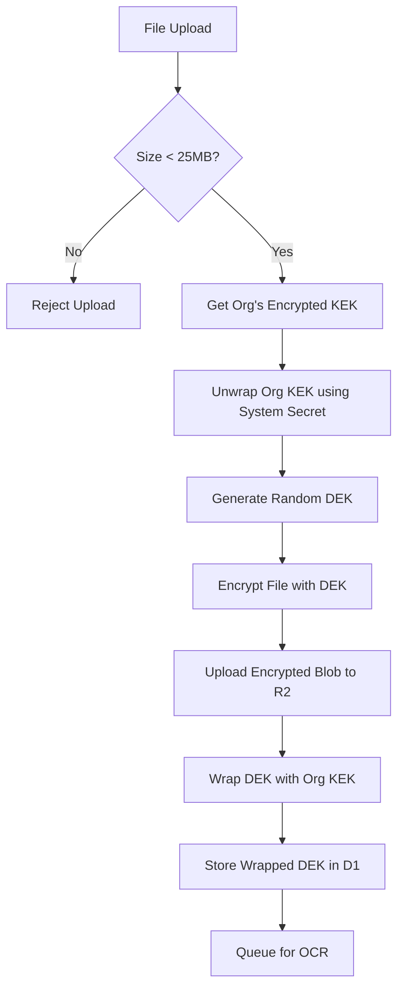

# AES-256 GCM Encryption Implementation Plan (Final)

**Project:** Dokra - Transient Privacy Architecture

**Date:** 2026-01-27

**Status:** Approved for Implementation

**Version:** 2.0

---

## Executive Summary

This plan outlines the implementation of **Envelope Encryption** for Project Dokra. All files and extracted OCR text will be encrypted at rest using AES-256-GCM.

The architecture uses a **System-to-Organization-to-Document** key hierarchy. This ensures that:

1. **Background Workers** (OCR) can process files without user interaction.
2. **Team Sharing** is native (all org members share the Org KEK).
3. **Performance** is optimized by treating the System Secret as a raw cryptographic key.

### Encryption Key Hierarchy

```
System Secret (Env Var: 64-char Hex String)
    ↓ (encrypts)
Organization KEK (Stored in DB, Unique per Org)
    ↓ (encrypts)
Document DEK (Stored in DB, Unique per File)
    ↓ (encrypts)
File Blob (R2) & OCR Text (D1)

```

---

## 1. Architecture Overview

### 1.1 Constraints & Limits

* **Max File Size:** **25MB** (Hard Limit).
* *Reasoning:* Cloudflare Workers have a ~128MB memory limit. AES-GCM requires loading the ciphertext + plaintext in RAM to verify the auth tag. Streaming decryption of >50MB files requires complex chunking logic (Phase 2).


* **System Secret Format:** Must be a **64-character Hex String** (32 bytes).

### 1.2 Encryption Flow (Upload)



---

## 2. Database Schema Changes

### 2.1 Updated Organizations Table

**File:** `shared/database/src/schema/organizations.ts`

```typescript
import { sqliteTable, text, integer } from 'drizzle-orm/sqlite-core';

export const organizations = sqliteTable('organizations', {
    id: text('id').primaryKey(),
    name: text('name').notNull(),
    ownerId: text('owner_id').notNull(),
    
    // Encryption Columns
    encryptedKek: text('encrypted_kek'),     // Org KEK encrypted by System Secret
    kekIv: text('kek_iv'),                   // The IV used for the wrapper
    kekTag: text('kek_tag'),                 // The Auth Tag
    kekCreatedAt: text('kek_created_at'),    
    
    // NEW: Version control for the Master Key (allows future rotation)
    systemKeyVersion: integer('system_key_version').default(1).notNull(),

    createdAt: text('created_at').notNull(),
    updatedAt: text('updated_at').notNull(),
});

```

### 2.2 Updated Users Table

*Clean up: Remove any legacy encryption columns if they existed.*

### 2.3 Updated Documents Table

**File:** `shared/database/src/schema/documents.ts`

```typescript
import { sqliteTable, text, integer, index, sql } from 'drizzle-orm/sqlite-core';

export const documents = sqliteTable('documents', {
    id: text('id').primaryKey(),
    organizationId: text('organization_id').notNull().references(() => organizations.id, { onDelete: 'cascade' }),
    r2Key: text('r2_key').notNull().unique(),
    
    // Metadata (Plaintext for UI speed)
    title: text('title').notNull(),
    fileName: text('file_name').notNull(),
    mimeType: text('mime_type'),
    fileSize: integer('file_size'),
    
    // Encrypted Content
    encryptedOcrContent: text('encrypted_ocr_content'), // Base64 Ciphertext
    ocrIv: text('ocr_iv'),
    ocrTag: text('ocr_tag'),
    
    status: text('status').notNull().default('inbox'),
    createdAt: text('created_at').default(sql`(CURRENT_TIMESTAMP)`).notNull(),
    // ... other fields
}, (table) => [
    index('documents_org_idx').on(table.organizationId),
]);

```

### 2.4 Updated Document Keys Table

**File:** `shared/database/src/schema/document-keys.ts`

```typescript
import { sqliteTable, text, index, sql } from 'drizzle-orm/sqlite-core';
import { organizations } from './organizations';
import { documents } from './documents';

export const documentKeys = sqliteTable('document_keys', {
    organizationId: text('organization_id').notNull().references(() => organizations.id, { onDelete: 'cascade' }),
    documentId: text('document_id').notNull().references(() => documents.id, { onDelete: 'cascade' }),
    
    // The File's Key, Encrypted by the Org KEK
    encryptedDek: text('encrypted_dek').notNull(),
    dekIv: text('dek_iv').notNull(),
    dekTag: text('dek_tag'),
    
    createdAt: text('created_at').default(sql`(CURRENT_TIMESTAMP)`).notNull(),
}, (table) => [
    index('doc_keys_lookup_idx').on(table.organizationId, table.documentId),
]);

```

---

## 3. Core Crypto Implementation

### 3.1 KeyManager Class (Optimized)

**File:** `shared/crypto/src/key-manager.ts`
*Change: Removed PBKDF2. Now assumes `SYSTEM_SECRET` is a raw hex key for speed.*

```typescript
import {
    generateIv,
    encryptAesGcm,
    decryptAesGcm,
    type WrappedKey
} from './crypto-utils';

export class KeyManager {
    private systemKey: CryptoKey | null = null;
    private readonly ALGORITHM = 'AES-GCM';

    constructor(private systemSecretHex: string) {
        if (!systemSecretHex || systemSecretHex.length !== 64) {
            throw new Error("SYSTEM_SECRET must be a 64-character hex string (32 bytes)");
        }
    }

    /**
     * Import the System Master Key from Hex String.
     * Skips PBKDF2 for performance.
     */
    private async getSystemKey(): Promise<CryptoKey> {
        if (this.systemKey) return this.systemKey;

        // Convert Hex String -> Uint8Array
        const keyBytes = new Uint8Array(
            this.systemSecretHex.match(/.{1,2}/g)!.map(byte => parseInt(byte, 16))
        );

        this.systemKey = await crypto.subtle.importKey(
            'raw',
            keyBytes,
            { name: this.ALGORITHM },
            false, // System key is never extractable
            ['encrypt', 'decrypt'] // Used to wrap/unwrap Org Keys
        );

        return this.systemKey;
    }

    // ==================== 1. Org Key Operations ====================

    async generateOrgKek(): Promise<Uint8Array> {
        return crypto.getRandomValues(new Uint8Array(32));
    }

    async wrapOrgKek(orgKek: Uint8Array): Promise<WrappedKey> {
        const systemKey = await this.getSystemKey();
        const iv = generateIv();
        
        // Encrypt the Org Key using the System Key
        const encrypted = await crypto.subtle.encrypt(
            { name: this.ALGORITHM, iv },
            systemKey,
            orgKek
        );
        
        return this.formatResult(encrypted, iv);
    }

    async unwrapOrgKek(ciphertext: string, iv: string, tag: string): Promise<Uint8Array> {
        const systemKey = await this.getSystemKey();
        const data = this.assembleCiphertext(ciphertext, tag);
        const ivBytes = this.fromBase64(iv);

        const decrypted = await crypto.subtle.decrypt(
            { name: this.ALGORITHM, iv: ivBytes },
            systemKey,
            data
        );

        return new Uint8Array(decrypted);
    }

    // ==================== 2. Document Key Operations ====================

    async generateDek(): Promise<Uint8Array> {
        return crypto.getRandomValues(new Uint8Array(32));
    }

    /**
     * Wrap a DEK using the Org KEK
     */
    async wrapDek(dek: Uint8Array, orgKek: Uint8Array): Promise<WrappedKey> {
        const iv = generateIv();
        const wrappingKey = await this.importRawKey(orgKek);

        const encrypted = await crypto.subtle.encrypt(
            { name: this.ALGORITHM, iv },
            wrappingKey,
            dek
        );

        return this.formatResult(encrypted, iv);
    }

    async unwrapDek(ciphertext: string, iv: string, tag: string, orgKek: Uint8Array): Promise<Uint8Array> {
        const wrappingKey = await this.importRawKey(orgKek);
        const data = this.assembleCiphertext(ciphertext, tag);
        const ivBytes = this.fromBase64(iv);

        const decrypted = await crypto.subtle.decrypt(
            { name: this.ALGORITHM, iv: ivBytes },
            wrappingKey,
            data
        );

        return new Uint8Array(decrypted);
    }

    // ==================== 3. File/Data Operations ====================

    async encryptData(data: BufferSource, dek: Uint8Array): Promise<WrappedKey> {
        const key = await this.importRawKey(dek);
        const iv = generateIv();

        const encrypted = await crypto.subtle.encrypt(
            { name: this.ALGORITHM, iv },
            key,
            data
        );

        return this.formatResult(encrypted, iv);
    }

    async decryptData(ciphertext: string, iv: string, tag: string, dek: Uint8Array): Promise<ArrayBuffer> {
        const key = await this.importRawKey(dek);
        const data = this.assembleCiphertext(ciphertext, tag);
        const ivBytes = this.fromBase64(iv);

        return await crypto.subtle.decrypt(
            { name: this.ALGORITHM, iv: ivBytes },
            key,
            data
        );
    }

    // ==================== Helpers ====================

    private async importRawKey(keyBytes: Uint8Array): Promise<CryptoKey> {
        return crypto.subtle.importKey(
            'raw',
            keyBytes,
            { name: this.ALGORITHM },
            false,
            ['encrypt', 'decrypt']
        );
    }

    private formatResult(encryptedBuffer: ArrayBuffer, iv: Uint8Array): WrappedKey {
        // Split Tag (last 16 bytes) from Ciphertext
        const raw = new Uint8Array(encryptedBuffer);
        const tagLength = 16;
        const ciphertext = raw.slice(0, raw.length - tagLength);
        const tag = raw.slice(raw.length - tagLength);

        return {
            ciphertext: this.toBase64(ciphertext),
            iv: this.toBase64(iv),
            tag: this.toBase64(tag)
        };
    }

    private assembleCiphertext(ciphertextB64: string, tagB64: string): Uint8Array {
        const c = this.fromBase64(ciphertextB64);
        const t = this.fromBase64(tagB64);
        const combined = new Uint8Array(c.length + t.length);
        combined.set(c);
        combined.set(t, c.length);
        return combined;
    }

    private toBase64(arr: Uint8Array): string { return btoa(String.fromCharCode(...arr)); }
    private fromBase64(str: string): Uint8Array { return Uint8Array.from(atob(str), c => c.charCodeAt(0)); }
}

```

---

## 4. Environment Setup

### 4.1 Generate System Secret

Run this command to generate your production secret:

```bash
openssl rand -hex 32
# Output example: 8a4b2c9d... (64 characters)

```

### 4.2 Wrangler Config (`wrangler.jsonc`)

```json
{
  "vars": {
    "ENCRYPTION_ENABLED": "true",
    "MAX_FILE_SIZE_MB": "25"
  },
  "secrets": [
    // Stores the 64-char Hex String
    { "name": "SYSTEM_SECRET", "provider": "cloudflare" }
  ]
}

```

---

## 5. Phase-by-Phase Implementation

### Phase 1: Foundation (The Secure Base)

* **Goal:** Uploads are encrypted, Downloads are decrypted. No OCR yet.
* **Tasks:**
1. Create `shared/crypto` package with `KeyManager`.
2. Update Drizzle Schema (`organizations`, `documents`, `documentKeys`).
3. Implement `POST /api/documents`:
* Validate size <= 25MB.
* Encrypt File (RAM) -> Upload R2.
* Wrap Keys -> Save D1.


4. Implement `GET /api/documents/:id/view`:
* Fetch -> Decrypt (RAM) -> Stream Response.


### Phase 2: Intelligence (The Worker)

* **Goal:** Background Worker can read files to extract text.
* **Tasks:**
1. Update `dokra-ocr-consumer` worker.
2. Inject `SYSTEM_SECRET` into the consumer's environment.
3. Logic:
* Unwrap Org KEK (using System Secret).
* Unwrap DEK.
* Decrypt File -> Send to Mistral.
* Encrypt Result -> Save to D1.


### Phase 3: Search (The Vector Index)

* **Goal:** Search finds documents without decrypting them.
* **Tasks:**
1. Embeddings are generated from the *plaintext* (transiently in the worker).
2. Vectors stored in Cloudflare Vectorize.
3. Search API queries Vectorize -> Returns IDs -> Fetches Metadata from D1.


---

## 6. Security Considerations (Final Check)

1. **Memory Exhaustion:**
* **Risk:** Decrypting large files in Worker memory causes crashes.
* **Mitigation:** Hard limit of **25MB** enforced at API level. Larger files require Phase 4 (Chunked Streaming).


2. **Key Isolation:**
* `SYSTEM_SECRET` is never logged.
* Unwrapped Keys (Org KEK, DEK) exist only in function scope and are garbage collected immediately after use.


3. **IV Reuse:**
* `generateIv()` uses `crypto.getRandomValues(12 bytes)` for every single operation. This guarantees semantic security for AES-GCM.