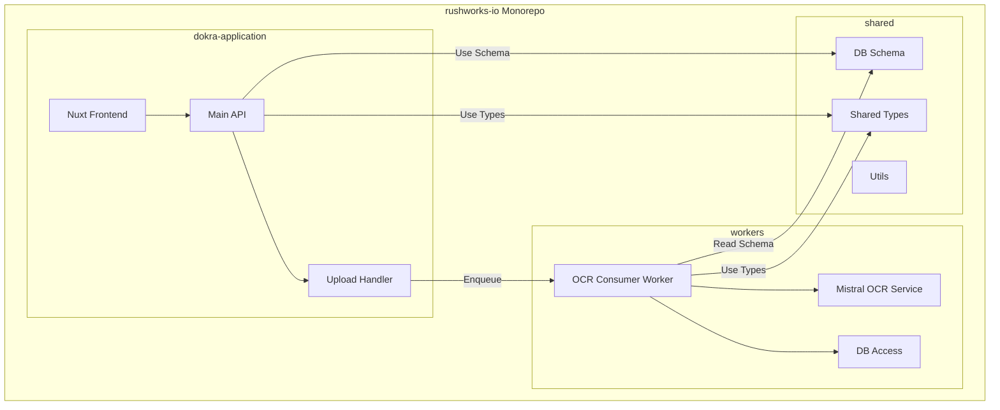

# OCR Directory Reorganization Plan - Monorepo Structure

## Proposed New Structure

```
rushworks-io/
├── dokra-application/              # Main Nuxt application
│   ├── wrangler.jsonc              # Main worker config
│   ├── app/                        # Nuxt frontend
│   ├── server/                     # Nuxt server/API
│   ├── docs/                       # Documentation
│   ├── package.json
│   └── tsconfig.json
│
├── workers/                        # OCR Workers
│   ├── wrangler.queue.jsonc        # OCR consumer config
│   ├── ocr-consumer/               # Mistral OCR worker
│   │   ├── index.ts                # Queue consumer entry point
│   │   ├── package.json            # Worker dependencies
│   │   ├── tsconfig.json           # Worker TypeScript config
│   │   ├── services/
│   │   │   └── mistral-ocr.ts      # Mistral OCR service
│   │   └── types/
│   │       └── ocr.ts              # OCR types
│   │
│   ├── external-ocr-1/             # Future: External OCR Worker 1
│   │   ├── index.ts
│   │   └── ...
│   │
│   └── external-ocr-2/             # Future: External OCR Worker 2
│       ├── index.ts
│       └── ...
│
└── shared/                         # Shared code for all workers
    ├── package.json                # Shared dependencies
    ├── wrangler.shared.jsonc       # Shared wrangler config
    ├── db/
    │   ├── schema/                 # Database schema
    │   │   ├── index.ts
    │   │   ├── documents.ts
    │   │   ├── files.ts
    │   │   ├── tags.ts
    │   │   └── ...
    │   ├── migrations/             # D1 migrations
    │   │   └── ...
    │   └── utils/
    │       └── db.ts               # DB connection utility
    │
    ├── types/                      # Shared types
    │   ├── index.ts
    │   ├── document.ts
    │   ├── user.ts
    │   └── ...
    │
    ├── utils/                      # Shared utilities
    │   ├── auth.ts
    │   └── storage.ts
    │
    └── env.d.ts                    # Shared Env types
```

## Architecture Diagram



## Detailed File Movements

### Files to Move from `dokra-application`

| Current Location | New Location |
|-----------------|--------------|
| `server/db/schema/*.ts` | `shared/db/schema/` |
| `server/db/utils/db.ts` | `shared/db/utils/db.ts` |
| `server/types/*.ts` | `shared/types/` |
| `server/utils/auth.ts` | `shared/utils/auth.ts` |
| `server/utils/storage.ts` | `shared/utils/storage.ts` |
| `server/workers/index..ts` | `workers/ocr-consumer/index.ts` |
| `server/services/mistral-ocr.ts` | `workers/ocr-consumer/services/mistral-ocr.ts` |
| `server/types/ocr.ts` | `workers/ocr-consumer/types/ocr.ts` |

### Files to Update in `dokra-application`

| File | Change |
|------|--------|
| `wrangler.jsonc` | Update D1 migrations path |
| `nuxt.config.ts` | Update TypeScript paths |
| `tsconfig.json` | Add path aliases |

### Files to Update in `workers/ocr-consumer`

| File | Change |
|------|--------|
| `index.ts` | Update import paths to `../../shared/...` |
| `services/mistral-ocr.ts` | Update import paths |
| `tsconfig.json` | Add path aliases |
| `package.json` | Add dependencies |

## Import Path Updates

### Before (monolithic)
```typescript
import {useDatabase} from '../utils/db';
import {documents} from '../db/schema';
import type {OCRJobMessage} from '../types/ocr';
```

### After (modular)
```typescript
// dokra-application
import {useDatabase} from '@shared/db/utils/db';
import {documents} from '@shared/db/schema';
import type {OCRJobMessage} from '@shared/types/ocr';

// workers/ocr-consumer
import {useDatabase} from '../../shared/db/utils/db';
import {documents} from '../../shared/db/schema';
import type {OCRJobMessage} from './types/ocr';
```

## TypeScript Path Aliases

### `dokra-application/tsconfig.json`
```json
{
  "compilerOptions": {
    "paths": {
      "@shared/*": ["../shared/*"]
    }
  }
}
```

### `workers/ocr-consumer/tsconfig.json`
```json
{
  "compilerOptions": {
    "paths": {
      "@shared/*": ["../../shared/*"]
    }
  }
}
```

## Wrangler Configuration Updates

### `shared/wrangler.shared.jsonc`
```jsonc
{
  "$schema": "node_modules/wrangler/config-schema.json",
  "name": "dokra-shared",
  "d1_databases": [
    {
      "binding": "DB",
      "database_name": "dokra-db",
      "database_id": "8da5548e-9f06-4d96-b665-65001f5f6982"
    }
  ],
  "r2_buckets": [
    {
      "binding": "R2",
      "bucket_name": "dokra-files",
      "jurisdiction": "eu"
    }
  ]
}
```

### `dokra-application/wrangler.jsonc`
```jsonc
{
  "$schema": "node_modules/wrangler/config-schema.json",
  "name": "dokra",
  // ... existing config
  "d1_databases": [
    {
      "binding": "DB",
      "database_name": "dokra-db",
      "database_id": "8da5548e-9f06-4d96-b665-65001f5f6982",
      "migrations_dir": "../shared/db/migrations"
    }
  ]
}
```

### `workers/wrangler.queue.jsonc`
```jsonc
{
  "$schema": "node_modules/wrangler/config-schema.json",
  "name": "dokra-ocr-consumer",
  "main": "ocr-consumer/index.ts",
  "d1_databases": [
    {
      "binding": "DB",
      "database_name": "dokra-db",
      "database_id": "8da5548e-9f06-4d96-b665-65001f5f6982"
    }
  ]
}
```

## Implementation Steps

### Step 1: Create Directory Structure
```bash
# Create top-level directories
mkdir -p workers/ocr-consumer/services
mkdir -p workers/ocr-consumer/types
mkdir -p shared/db/schema
mkdir -p shared/db/utils
mkdir -p shared/types
mkdir -p shared/utils
```

### Step 2: Move Shared Code
```bash
# Move DB schema
cp dokra-application/server/db/schema/*.ts shared/db/schema/
rm dokra-application/server/db/schema/*.ts

# Move DB utils
cp dokra-application/server/utils/db.ts shared/db/utils/
rm dokra-application/server/utils/db.ts

# Move types
cp dokra-application/server/types/*.ts shared/types/
rm dokra-application/server/types/*.ts

# Move utils
cp dokra-application/server/utils/auth.ts shared/utils/
cp dokra-application/server/utils/storage.ts shared/utils/
rm dokra-application/server/utils/auth.ts
rm dokra-application/server/utils/storage.ts
```

### Step 3: Move OCR Worker Code
```bash
# Move OCR consumer
cp dokra-application/server/workers/index..ts workers/ocr-consumer/index.ts
rm dokra-application/server/workers/index..ts

# Move OCR service
cp dokra-application/server/services/mistral-ocr.ts workers/ocr-consumer/services/
rm dokra-application/server/services/mistral-ocr.ts

# Copy OCR types to worker
cp shared/types/ocr.ts workers/ocr-consumer/types/
```

### Step 4: Update Import Paths
- Update all imports in `dokra-application/server/` to use `@shared/...`
- Update all imports in `workers/ocr-consumer/` to use `../../shared/...`

### Step 5: Update Configuration Files
- Update `dokra-application/wrangler.jsonc` with new migrations path
- Update TypeScript configs with path aliases
- Update package.json files if needed

## Benefits of This Structure

1. **Clear Separation**: Three distinct directories for application, workers, and shared code
2. **Reusability**: Shared code can be imported by all workers
3. **Scalability**: Easy to add new external OCR workers
4. **Maintainability**: Each directory has clear responsibilities
5. **Type Safety**: Shared types ensure consistency across workers

## Future Extensions

```
workers/
├── ocr-consumer/          # Current: Mistral OCR
├── external-ocr-1/        # Future: OpenAI Vision
├── external-ocr-2/        # Future: Google Cloud Vision
├── external-ocr-3/        # Future: Custom OCR Worker
└── ocr-router/            # Future: Router to distribute to OCR workers
```

---

**Created**: 2026-01-25
**Status**: Ready for review
```bash
# Move DB schema
cp dokra-application/server/db/schema/*.ts shared/db/schema/
rm dokra-application/server/db/schema/*.ts

# Move DB utils
cp dokra-application/server/utils/db.ts shared/db/utils/
rm dokra-application/server/utils/db.ts

# Move types
cp dokra-application/server/types/*.ts shared/types/
rm dokra-application/server/types/*.ts

# Move utils
cp dokra-application/server/utils/auth.ts shared/utils/
cp dokra-application/server/utils/storage.ts shared/utils/
rm dokra-application/server/utils/auth.ts
rm dokra-application/server/utils/storage.ts
```

### Step 3: Move OCR Worker Code
```bash
# Move OCR consumer
cp dokra-application/server/workers/index..ts workers/ocr-consumer/index.ts
rm dokra-application/server/workers/index..ts

# Move OCR service
cp dokra-application/server/services/mistral-ocr.ts workers/ocr-consumer/services/
rm dokra-application/server/services/mistral-ocr.ts

# Copy OCR types to worker
cp shared/types/ocr.ts workers/ocr-consumer/types/
```

### Step 4: Update Import Paths
- Update all imports in `dokra-application/server/` to use `@shared/...`
- Update all imports in `workers/ocr-consumer/` to use `../../shared/...`

### Step 5: Update Configuration Files
- Update `dokra-application/wrangler.jsonc` with new migrations path
- Update TypeScript configs with path aliases
- Update package.json files if needed

## Benefits of This Structure

1. **Clear Separation**: Three distinct directories for application, workers, and shared code
2. **Reusability**: Shared code can be imported by all workers
3. **Scalability**: Easy to add new external OCR workers
4. **Maintainability**: Each directory has clear responsibilities
5. **Type Safety**: Shared types ensure consistency across workers

## Future Extensions

```
workers/
├── ocr-consumer/          # Current: Mistral OCR
├── external-ocr-1/        # Future: OpenAI Vision
├── external-ocr-2/        # Future: Google Cloud Vision
├── external-ocr-3/        # Future: Custom OCR Worker
└── ocr-router/            # Future: Router to distribute to OCR workers
```

---

**Created**: 2026-01-25
**Status**: Ready for review

