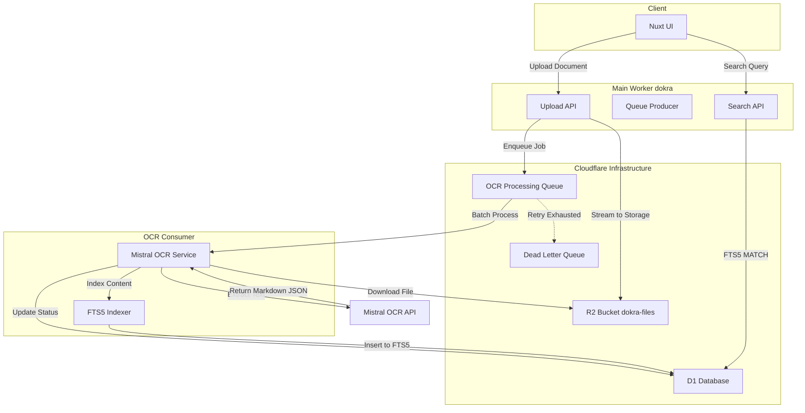

# OCR Scanning Implementation Plan

## Overview

This document outlines the implementation of automatic OCR scanning using Mistral API, Cloudflare Queues for async processing, and SQLite FTS5 for full-text search.

## Architecture Diagram



## Phase 1: Infrastructure & Configuration

### 1.1 Update wrangler.jsonc

Add Queue bindings and secrets:

```json
{
  "queues": {
    "producers": [
      {
        "name": "ocr-processing-queue",
        "queue_name": "ocr-processing-queue",
        "binding": "OCR_QUEUE"
      }
    ],
    "consumers": [
      {
        "queue_name": "ocr-processing-queue",
        "binding": "OCR_QUEUE"
      }
    ]
  },
  "secrets": {
    "MISTRAL_API_KEY": "your-mistral-api-key"
  }
}
```

### 1.2 Environment Variables

Add to `.env` for local development:
```env
# Mistral OCR
MISTRAL_API_KEY=your-api-key-here
```

## Phase 2: Database Schema Updates

### 2.1 Documents Table Enhancement

The existing `documents` table needs status tracking for OCR:

```typescript
// server/db/schema/documents.ts - Add status enum values
// Current: inbox, verified, archived
// Add: processing, ocr_pending, ocr_failed
```

### 2.2 FTS5 Virtual Table Migration

Create `server/db/migrations/0001_fts_setup.sql`:

```sql
-- Create FTS5 virtual table for full-text search
CREATE VIRTUAL TABLE IF NOT EXISTS documents_fts USING fts5(
    documentId,
    title,
    extractedText,
    content='documents',
    content_rowid='rowid'
);

-- Create trigger to sync documents table with FTS5
CREATE TRIGGER IF NOT EXISTS documents_ai AFTER INSERT ON documents BEGIN
    INSERT INTO documents_fts(rowid, documentId, title, extractedText)
    VALUES (new.rowid, new.id, new.title, new.extractedText);
END;

CREATE TRIGGER IF NOT EXISTS documents_ad AFTER DELETE ON documents BEGIN
    INSERT INTO documents_fts(documents_fts, rowid, documentId, title, extractedText)
    VALUES('delete', old.rowid, old.id, old.title, old.extractedText);
END;

CREATE TRIGGER IF NOT EXISTS documents_au AFTER UPDATE ON documents BEGIN
    INSERT INTO documents_fts(documents_fts, rowid, documentId, title, extractedText)
    VALUES('delete', old.rowid, old.id, old.title, old.extractedText);
    INSERT INTO documents_fts(rowid, documentId, title, extractedText)
    VALUES (new.rowid, new.id, new.title, new.extractedText);
END;
```

## Phase 3: Queue Producer Implementation

### 3.1 Create Queue Types

```typescript
// server/types/ocr.ts
export interface OCRJobMessage {
    documentId: string;
    organizationId: string;
    r2Key: string;
    mimeType: string;
    fileName: string;
    retryCount: number;
    createdAt: string;
}

export interface OCRJobResult {
    success: boolean;
    documentId: string;
    extractedText?: string;
    error?: string;
    processedAt: string;
}
```

### 3.2 Update Document Upload API

Modify `server/api/documents/index.post.ts`:

```typescript
// After successful R2 upload and DB insert, add:
import type { OCRJobMessage } from '~/server/types/ocr';

const ocrJob: OCRJobMessage = {
    documentId,
    organizationId,
    r2Key,
    mimeType,
    fileName: originalFileName,
    retryCount: 0,
    createdAt: now,
};

// Send to queue
await event.context.cloudflare.env.OCR_QUEUE.send(ocrJob);

// Update document status
await db.update(documents)
    .set({ status: 'ocr_pending' })
    .where(eq(documents.id, documentId));
```

## Phase 4: OCR Consumer Worker

### 4.1 Create Queue Consumer Handler

Create `server/workers/ocr-consumer.ts`:

```typescript
export default {
    async queue(
        batch: MessageBatch<OCRJobMessage>,
        env: Env
    ): Promise<void> {
        for (const message of batch.messages) {
            try {
                await processOCRJob(message.body, env);
                await message.ack();
            } catch (error) {
                console.error('OCR job failed:', error);
                
                if (message.body.retryCount < 3) {
                    // Retry with backoff - Cloudflare handles this automatically
                    await message.retry();
                } else {
                    // Move to dead letter
                    await env.OCR_DLQ.send(message.body);
                    await updateDocumentStatus(message.body.documentId, 'ocr_failed', env);
                    await message.ack();
                }
            }
        }
    }
};
```

### 4.2 Mistral OCR Integration

Create `server/services/mistral-ocr.ts`:

```typescript
export async function performOCR(
    fileData: ArrayBuffer,
    mimeType: string,
    env: Env
): Promise<string> {
    const base64Data = Buffer.from(fileData).toString('base64');
    
    const response = await fetch('https://api.mistral.ai/v1/ocr', {
        method: 'POST',
        headers: {
            'Authorization': `Bearer ${env.MISTRAL_API_KEY}`,
            'Content-Type': 'application/json',
        },
        body: JSON.stringify({
            model: 'mistral-ocr-latest',
            documents: [{
                type: mimeType,
                data: base64Data,
            }],
            instructions: 'Extract all text content and return as markdown. Preserve headings, lists, and structure.',
        }),
    });

    if (!response.ok) {
        throw new Error(`Mistral OCR API failed: ${response.statusText}`);
    }

    const result = await response.json();
    return result.pages.map((page: any) => page.markdown).join('\n\n');
}
```

### 4.3 File Retrieval from R2

```typescript
async function getFileFromR2(r2Key: string, env: Env): Promise<ArrayBuffer> {
    const r2 = env.R2;
    const object = await r2.get(r2Key);
    
    if (!object) {
        throw new Error(`File not found in R2: ${r2Key}`);
    }
    
    return await object.arrayBuffer();
}
```

## Phase 5: Database Updates & FTS5 Sync

### 5.1 Update Document with OCR Results

```typescript
async function updateDocumentWithOCR(
    documentId: string,
    extractedText: string,
    env: Env
): Promise<void> {
    const db = useDatabase(env.DB);
    const now = new Date().toISOString();
    
    await db.transaction(async (tx) => {
        // Update main document
        await tx.update(documents)
            .set({
                extractedText,
                status: 'inbox', // Back to inbox after OCR
                processedAt: now,
                updatedAt: now,
            })
            .where(eq(documents.id, documentId));
        
        // Insert into FTS5 (manual sync since triggers may not work in D1)
        await tx.insert(ocrSearch).values({
            documentId,
            content: extractedText,
            title: '', // Will be joined from documents table
            indexedAt: now,
        });
    });
}
```

### 5.2 Failed Job Handling

```typescript
async function handleFailedJob(
    documentId: string,
    error: string,
    env: Env
): Promise<void> {
    const db = useDatabase(env.DB);
    
    await db.update(documents)
        .set({
            status: 'ocr_failed',
            metadata: JSON.stringify({
                ocrError: error,
                failedAt: new Date().toISOString(),
            }),
            updatedAt: new Date().toISOString(),
        })
        .where(eq(documents.id, documentId));
}
```

## Phase 6: Search Implementation

### 6.1 Create Search API Endpoint

Create `server/api/search.post.ts`:

```typescript
export default defineEventHandler(async (event) => {
    const { query, organizationId } = await readBody(event);
    const db = useDatabase(event.context.cloudflare.env.DB);
    
    // FTS5 search query
    const results = await db.select({
        id: documents.id,
        title: documents.title,
        fileName: documents.fileName,
        documentType: documents.documentType,
        status: documents.status,
        createdAt: documents.createdAt,
        excerpt: ocrSearch.content,
    })
    .from(documents)
    .innerJoin(ocrSearch, eq(documents.id, ocrSearch.documentId))
    .where(and(
        eq(documents.organizationId, organizationId),
        sql`documents_fts MATCH ${query}`
    ))
    .limit(50);
    
    return { results };
});
```

## Phase 7: UI Updates

### 7.1 Document Status Display

Update `app/components/document/item/Status.vue` to show:
- `ocr_pending` - Show spinner/processing indicator
- `ocr_failed` - Show error icon with retry button

### 7.2 Retry Failed OCR

Create API endpoint `server/api/documents/[id]/retry-ocr.post.ts`:

```typescript
export default defineEventHandler(async (event) => {
    const documentId = getRouterParam(event, 'id');
    const db = useDatabase(event.context.cloudflare.env.DB);
    
    // Get document info
    const doc = await db.query.documents.findFirst({
        where: eq(documents.id, documentId),
    });
    
    if (!doc) {
        throw createError({ status: 404, message: 'Document not found' });
    }
    
    // Re-enqueue for OCR
    await event.context.cloudflare.env.OCR_QUEUE.send({
        documentId: doc.id,
        organizationId: doc.organizationId,
        r2Key: doc.r2Key,
        mimeType: doc.mimeType || 'application/pdf',
        fileName: doc.fileName,
        retryCount: 0,
        createdAt: new Date().toISOString(),
    });
    
    // Update status
    await db.update(documents)
        .set({ status: 'ocr_pending', updatedAt: new Date().toISOString() })
        .where(eq(documents.id, documentId));
    
    return { success: true };
});
```

## File Structure Changes

```
server/
├── api/
│   ├── documents/
│   │   ├── index.post.ts        # Modified - enqueue OCR job
│   │   └── [id]/
│   │       └── retry-ocr.post.ts # NEW - retry failed OCR
│   └── search.post.ts           # NEW - FTS5 search
├── db/
│   ├── migrations/
│   │   └── 0001_fts_setup.sql   # NEW - FTS5 table & triggers
│   └── schema/
│       └── documents.ts         # MODIFIED - add status values
├── services/
│   └── mistral-ocr.ts          # NEW - Mistral API integration
├── types/
│   └── ocr.ts                  # NEW - Queue message types
└── workers/
    └── ocr-consumer.ts         # NEW - Queue consumer handler

wrangler.jsonc                  # MODIFIED - add Queue bindings
.env                            # MODIFIED - add MISTRAL_API_KEY
```

## Implementation Order

1. **Phase 1**: Update wrangler.jsonc with Queue bindings and secrets
2. **Phase 2**: Create FTS5 migration file
3. **Phase 3**: Create OCR types and queue producer in upload API
4. **Phase 4**: Create Mistral OCR service
5. **Phase 5**: Create OCR consumer worker
6. **Phase 6**: Create search API endpoint
7. **Phase 7**: Create retry endpoint and UI updates
8. **Testing**: End-to-end test the flow

## Dead Letter Queue Setup

The dead letter queue will store failed OCR jobs for debugging. Create it via wrangler:

```bash
npx wrangler queue create ocr-processing-queue --dead-letter-queue ocr-failed-queue
```

## Migration Steps

```bash
# 1. Add secret
npx wrangler secret put MISTRAL_API_KEY

# 2. Run migrations
npx drizzle-kit migrate

# 3. Deploy
npx wrangler deploy
```

## Error Handling

| Scenario | Action |
|----------|--------|
| Mistral API timeout | Retry up to 3 times with exponential backoff |
| File not found in R2 | Mark as failed, log error |
| Invalid file format | Mark as failed, notify user |
| OCR content too large | Store partial content, log warning |

## Performance Considerations

- Queue batch size: 10 messages per batch
- R2 file download: Stream directly to avoid memory issues
- Large documents: Process in chunks if needed
- FTS5 indexing: Deferred indexing for very large texts
